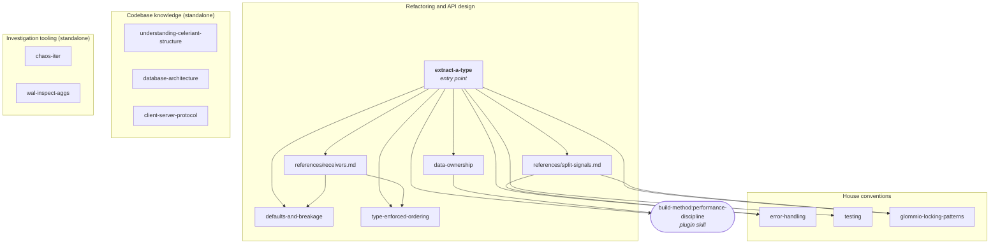

# Project skills

Skills the agent loads while working in this repo. Each is a directory holding a `SKILL.md` with `name` and `description` frontmatter. Only the name and description are preloaded; the body loads when the skill is invoked, so every line in a body is a recurring context cost.

Twelve skills in four groups. Four of them form a connected refactoring set; the rest are standalone and entered directly.

## Groups

| Group | Skills | Entered by |
|---|---|---|
| Refactoring and API design | `extract-a-type`, `defaults-and-breakage`, `type-enforced-ordering`, `data-ownership` | `extract-a-type` from a cold prompt, the rest by routing |
| House conventions | `error-handling`, `testing`, `glommio-locking-patterns` | Directly, or routed from `extract-a-type` |
| Codebase knowledge | `understanding-celeriant-structure`, `database-architecture`, `client-server-protocol` | Directly |
| Investigation tooling | `chaos-iter`, `wal-inspect-aggs` | Directly, during an investigation |

## Relationships

Every arrow is a real reference in a skill body. The knowledge and tooling groups have no arrows because nothing routes to them; they are loaded when the task calls for them.

## Refactoring and API design

**`extract-a-type`** is the entry point. It fires on "refactor X", "clean up X", "tidy this file", "dedupe this". Four phases: diagnose read-only, agree on scope with the programmer, refactor, verify. Its core discipline is a drift table built before any edit, a mandatory stop for agreement, and keeping refactors, contract changes and bug fixes in separate commits.

Two subskills under `references/`, loaded only when that decision comes up:

- **`references/receivers.md`** covers choosing `&self`, `&mut self` or `self` for methods moved onto a type, keeping field privatisation separate from adding methods, and control flow that stays readable in a debugger.
- **`references/split-signals.md`** covers deciding whether a type is really two types, using error variant grouping and mutation patterns as evidence.

**`defaults-and-breakage`** decides whether adding a field to a config type should break callers or none of them. Classifying fields as required or defaulted, private fields versus `#[non_exhaustive]`, and the Cargo compatibility rules that say which changes are major.

**`type-enforced-ordering`** moves a call-order or cleanup rule from a doc comment into the type system. Receipt tokens, typestate, RAII guards, and when a typed runtime error is the right answer instead.

**`data-ownership`** chooses how a function gets its data. Passing dependencies rather than reaching for globals, borrowing within an operation versus storing a borrow, and the owned / shared-pointer / handle options when a struct would otherwise hold a reference.

## House conventions

**`error-handling`** is the repo's error rules: typed enum variants over strings, manual `From` impls, no thiserror, and how errors reach clients.

**`testing`** covers unit tests with the `glommio_test!` macro, integration tests through the runner and its category registry, and Criterion benchmarks.

**`glommio-locking-patterns`** covers synchronisation on single-threaded executors. Mainly one rule: never hold a `RefCell` borrow across an `.await`.

## Codebase knowledge

**`understanding-celeriant-structure`** maps the crates and what each is responsible for. Start here when navigating.

**`database-architecture`** holds the core invariants: memory bounds, WAL durability, the write pipeline, storage layout, tracing.

**`client-server-protocol`** covers protocol invariants, network behaviour, failure modes and shard routing.

## Investigation tooling

Both delegate a noisy job to a subagent and return a summary, to keep raw output out of the main conversation.

**`chaos-iter`** runs one chaos scenario on the rpi cluster and reports integrity and replication metrics.

**`wal-inspect-aggs`** runs `celeriant-wal-inspect` across shards for a list of failing aggregates and returns a disk-truth table.

## Conventions for adding a skill

- **No references to source files, types or crate names.** Paths rot silently and nothing checks them. State the rule so it stands on its own; if an example is needed, describe the shape rather than naming the file.
- **Reference other skills by name in backticks**, never by relative path. Names survive a move between this directory and the user-level one.
- **Write descriptions for selection, not for summary.** They are matched against what the user typed, so lead with the trigger vocabulary. Name the alternative when a skill is commonly confused with another.
- **Write bodies as imperative instructions.** No rationale essays, no second person. The body is read by a model on every turn it stays loaded.
- **Push detail one level deep** into `references/` once a `SKILL.md` outgrows its siblings.
