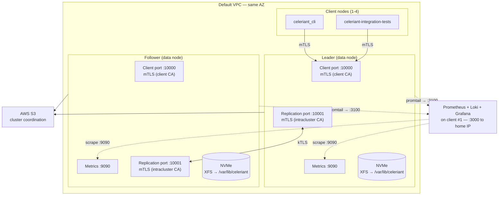

# EC2 Performance Test Cluster

AWS CDK stack that deploys a Celeriant cluster for performance benchmarking
and kTLS testing. Mirrors the RPi LAN cluster (`deploy/rpi-cluster`) with a
Makefile-driven workflow, systemd services, and automated benchmark collection.

## Architecture



## Spot by default

Every instance is a one-time spot request that terminates on reclaim. A benchmark cluster
lives for well under an hour and is rebuilt from scratch each run, so an interruption costs
a re-run and nothing else — and spot is roughly 70% cheaper (`i4i.16xlarge` in
`ap-southeast-2`: ~$1.93/hr vs $6.58 on-demand). No max price is set; capping below
on-demand only trades money for capacity failures. Use `-c spot=false` for on-demand.

Spot arrives via a launch template — `AWS::EC2::Instance` has no market options in
CloudFormation — that carries the market options and nothing else.

> **Quota:** spot has its own vCPU limit, separate from on-demand ("All Standard Spot
> Instance Requests"). `PROFILE=i4i-64c` needs exactly 192 (2×64 + 4×16), so the common
> 192 default leaves no headroom. Check with
> `aws service-quotas get-service-quota --service-code ec2 --quota-code L-34B43A08`.

## Instance type flexibility

Use `-c instanceType=...` for data nodes and `-c clientInstanceType=...` for the benchmark
client(s). Data nodes default to local **instance store (NVMe)**, which is what every
published benchmark uses. Client nodes only need CPU (no disk I/O), so compute-optimized
instances work well.

Architecture (x86_64 vs ARM64) is auto-detected from the instance type family. ARM families
(i4g, c7g, etc.) get an ARM AMI; all others get x86_64. Data and client nodes must match
architecture — use `make build` for x86_64 or `make build-arm` for ARM.

### Data node instance types

| Use case | Instance | vCPU | NVMe | $/hr per node |
|---|---|---|---|---|
| Cheap smoke test | `c6id.xlarge` | 4 | 1x 237GB | ~$0.22 |
| Standard benchmark | `c6id.2xlarge` | 8 | 1x 474GB | ~$0.45 |
| Storage-optimized (8c) | `i4i.2xlarge` | 8 | 1x 468GB | ~$0.72 |
| Storage-optimized (16c) | `i4i.4xlarge` | 16 | 1x 937GB | ~$1.44 |
| **Storage-optimized (32c)** | **`i4i.8xlarge`** | **32** | **2x 1875GB Nitro SSD** | **~$3.60** |
| Storage-optimized ARM (8c) | `i4g.2xlarge` | 8 | 1x 468GB | ~$0.58 |
| Storage-optimized ARM (16c) | `i4g.4xlarge` | 16 | 1x 937GB | ~$1.15 |
| Storage-optimized ARM (32c) | `i4g.8xlarge` | 32 | 2x 1875GB Nitro SSD | ~$2.88 |

Multi-NVMe instances (i4i.8xlarge and up) are **RAID0-striped across all their NVMes by
default**. For an append-only event store the headline win is **capacity** — the full
aggregate of every drive (6.8T on the 8xlarge, 13.6T on the 16xlarge vs 3.4T on one), so far
more events live on local NVMe before compaction/S3 offload. Throughput is a bonus: ~neutral
on the 8xlarge, **~+32% on the 16xlarge** (where one drive saturates under 64-core load).
Single-NVMe instances are unaffected (the one drive is mounted directly). Use `-c raid0=false`
to force a single drive (e.g. to reproduce the saturation in the `iostat` summary).

### Client node instance types

The client runs the tokio-based benchmark (`rpi_cluster_pool_bench`) which scales across
all available cores. Use compute-optimized instances to avoid bottlenecking the benchmark.
Multiple clients can be deployed with `-c clientCount=N` (max 4) to eliminate client-side
bottlenecks at high concurrency — tasks are split evenly across clients.

| Use case | Instance | vCPU | $/hr |
|---|---|---|---|
| Match data nodes | *(same as instanceType)* | — | — |
| Compute-optimized x86 | `c7i.4xlarge` | 16 | ~$0.97 |
| Compute-optimized x86 (large) | `c7i.8xlarge` | 32 | ~$1.93 |
| Compute-optimized ARM | `c7g.4xlarge` | 16 | ~$0.78 |
| Compute-optimized ARM (large) | `c7g.8xlarge` | 32 | ~$1.56 |

> **EBS:** `-c storageType=ebs` works. The WAL-open hang that used to wedge EBS data nodes
> was a `SchemaKey`/`AggregateKey` bloom-hash collision, fixed and validated on EBS
> 2026-08-09 — not an io_uring/Glommio limitation as previously recorded here. Instance
> store is still the default and the basis of the published numbers; EBS has not been
> swept for throughput.

## Prerequisites

1. **AWS CLI configured** — run `aws configure` or `aws sso login`
2. **SSH key pair imported** — import your key into AWS:
   ```bash
   aws ec2 import-key-pair --key-name my-key --public-key-material fileb://~/.ssh/id_rsa.pub
   ```
3. **CDK bootstrapped** (one-time per account/region):
   ```bash
   cd deploy/ec2-cluster && npm install && npx cdk bootstrap
   ```
4. **Docker** — required for building binaries. A local `cargo build --release` produces binaries
   linked against your system's glibc, which is newer than Amazon Linux 2023's glibc 2.34.
   The binary will fail with `GLIBC_2.XX not found` on EC2. The `make build` / `make build-arm`
   targets run the build inside an `amazonlinux:2023` Docker container so the binary links
   against the correct glibc. For ARM builds, QEMU binfmt is used to emulate aarch64 (~15-40 min
   first build, seconds on subsequent builds if deps are cached). `make deploy` checks the
   binary's max glibc and refuses to ship a host build, so this trap fails fast rather than on EC2.

## Quick start

```bash
cd deploy/ec2-cluster

# 1. Build binaries in the amazonlinux:2023 container. REQUIRED — a host `cargo build`
#    links against newer glibc and fails on EC2; `make deploy` rejects such binaries.
make build          # x86_64 (c6id, i4i, c7i)
make build-arm      # ARM64 (i4g, c7g) — requires QEMU binfmt
# ⚠️ Both targets output to target/release/ — building one overwrites the other.
#    Always rebuild before deploying if you switched architecture.

# 2. Deploy infrastructure (NVMe instance store required — see instance types above).
#    Grafana access is auto-opened to your current public IP — override with
#    HOME_IP=1.2.3.4/32, or disable with HOME_IP= (SSH-tunnel only).
make infra CDK_ARGS="-c keyPair=my-key"

# Canonical 32-core x86 benchmark shape (matches docs/benchmark-results/ec2-benchmark.md):
#   2x i4i.8xlarge data + 3x c7i.4xlarge clients
make infra PROFILE=i4i-32c CDK_ARGS="-c keyPair=my-key"

# ARM equivalent (20% cheaper):
make infra PROFILE=i4g-32c CDK_ARGS="-c keyPair=my-key"

# Custom shape — pass flags directly:
make infra CDK_ARGS="-c keyPair=my-key \
  -c instanceType=i4i.4xlarge \
  -c clientInstanceType=c7i.4xlarge"

# 3. Generate certs and deploy everything
make certs
make deploy KEY_ARG="--key-file ~/.ssh/id_rsa"

# 4. Start the cluster (leader first, then follower)
make start

# 5. (optional) Stand up self-hosted Grafana/Prometheus/Loki on client #1 to watch
#    the run live. Grafana: http://<client1-public-ip>:3000 (admin/admin), reachable
#    from the IP `make infra` opened.
make setup-infra

# 6. Benchmark
make run-benchmark    # single level, concurrency auto-sized to your cluster's knee + disk %util
make run-sweep        # full concurrency curve → CSV
make stop
```

Each `run-benchmark` / `run-sweep` also captures `iostat -x` on the data nodes and prints a
per-device `%util` summary (saved next to the results). RAID0 across all NVMes is the default;
deploy with `-c raid0=false` to compare a single drive and see whether striping is helping.

## Structure

```
deploy/ec2-cluster/
├── Makefile                     # Orchestration (mirrors rpi-cluster)
├── bin/ec2-cluster.ts           # CDK app entry point
├── lib/ec2-cluster-stack.ts     # Stack: 2 data + N client EC2, S3, SG, IAM, user data
├── infra/                       # Self-hosted observability stack (deployed to client #1)
│   ├── docker-compose.yml       # Prometheus + Loki + Grafana (no MinIO — EC2 uses real S3)
│   ├── prometheus.yml           # Scrape template (data node IPs filled in at setup)
│   └── grafana-provisioning/    # Datasources + dashboard provider
├── scripts/
│   ├── generate-certs.sh        # Dual-CA cert generation with IP SANs
│   ├── deploy.sh                # Deploys binaries, certs, env files to all nodes
│   ├── setup-infra.sh           # Stands up the infra stack + promtail on data nodes
│   ├── iostat-lib.sh            # Per-device disk capture, sourced by the bench scripts
│   ├── run-benchmark.sh         # Runs benchmark on client(s), aggregates results
│   └── run-sweep.sh             # Concurrency sweep, CSV output
├── certs/                       # Generated certs (gitignored)
├── results/                     # Benchmark results (gitignored)
├── .cluster-env                 # Cached IPs/config (gitignored, written by deploy.sh)
├── cdk.json
└── package.json
```

## Day-to-day commands

```bash
make help              # Show all targets
make build             # Build x86_64 binaries in Docker
make build-arm         # Build ARM64 binaries in Docker (QEMU)
make infra             # Deploy CDK stack
make certs             # Generate TLS certificates
make deploy            # Deploy binaries, certs, env files
make start             # Start cluster (leader first)
make stop              # Stop cluster
make restart           # Stop then start
make status            # Check service status
make logs              # Tail logs from both nodes (Ctrl+C to stop)
make setup-infra       # Stand up Grafana/Prometheus/Loki on client #1
make run-benchmark     # Run benchmark and save results
make run-sweep         # Concurrency sweep, CSV output
make sync-env          # Re-read CDK outputs into .cluster-env
make teardown          # Stop cluster + destroy CDK stack
make teardown-data     # Wipe data on data nodes
```

### Benchmark configuration

The benchmark runs `rpi_cluster_pool_bench` — a pool-based write benchmark with
automatic leader failover, connecting to both nodes (same test the RPi cluster uses).

Each task owns one aggregate **and one connection**, both fixed for the run. That pairing
is what makes the numbers mean anything: the server answers a request for an aggregate
owned by another shard by moving the whole TCP stream across the intrashard mesh
(`check_client_redirect`), so a load generator that lets connections drift between tasks
measures connection handover instead of writes. `BENCH_PINNED=0` restores the drifting
behaviour if you want to price it — see `docs/benchmark-results/ec2-benchmark.md`.

With multiple clients (`-c clientCount=N`), total tasks are split evenly across clients
and run in parallel. Results are aggregated (requests summed, per-client stats shown).

By default `make run-benchmark` **auto-sizes** total concurrency to the data-node vCPU
count (~1,125 connections/vCPU, 1:1 with tasks), landing near the measured throughput
knee — e.g. `i4i.8xlarge` (32 vCPU) → 36,000 tasks → ~358k req/s at P99 ~135ms. No
arguments needed; it adapts to whatever cluster you deployed (8c→9k, 32c→36k, 64c→72k).

Override via Make variables — `BENCH_TASKS` is total tasks (split across clients),
`BENCH_CONNS` is the per-client connection pool (defaults to 1:1 with tasks):

```bash
make run-benchmark                                       # auto-sized to the cluster (knee)
make run-benchmark BENCH_TASKS=84000                     # push into the saturation peak
make run-benchmark BENCH_TASKS=36000 BENCH_CONNS=4000 BENCH_DURATION=30  # tasks over a smaller pool
```

Results are saved to `results/<timestamp>_<instance-type>_<storage-type>.txt` with
metadata headers for easy comparison across instance types.

### Cluster profiles

`PROFILE=` selects a named cluster shape; the flags are appended to `CDK_ARGS`.

| `PROFILE` | Data nodes | Client nodes | Notes |
|---|---|---|---|
| `default` *(unset)* | per `instanceType` | per `clientInstanceType` | one-off / custom shapes |
| `i4i-32c` | 2x i4i.8xlarge | 3x c7i.4xlarge | matches `docs/benchmark-results/ec2-benchmark.md` 32-core sweep |
| `i4i-64c` | 2x i4i.16xlarge | 4x c7i.4xlarge | 64-core sweep; RAID0 across all 4 NVMes (default) |
| `i4g-32c` | 2x i4g.8xlarge | 3x c7g.4xlarge | ARM equivalent — use `make build-arm` |

### CDK context overrides

| Flag | Default | Example |
|---|---|---|
| `instanceType` | `c6id.2xlarge` | `-c instanceType=i4i.8xlarge` |
| `clientInstanceType` | *(same as instanceType)* | `-c clientInstanceType=c7i.4xlarge` |
| `clientCount` | `1` | `-c clientCount=3` (max 4) |
| `storageType` | `instance-store` | `-c storageType=ebs` works (see EBS note above); instance store is the published baseline |
| `ebsDataVolumeSize` | `100` (GB) | `-c ebsDataVolumeSize=200` (EBS only) |
| `raid0` | *(true)* | RAID0-stripes all instance-store NVMes by default; `-c raid0=false` uses only the first drive |
| `spot` | *(true)* | All instances are one-time spot requests; `-c spot=false` uses on-demand |
| `homeIp` | *(auto)* | `make infra` auto-detects your public IP and opens Grafana :3000 to it; override with `HOME_IP=1.2.3.4/32` or skip with `HOME_IP=` |
| `keyPair` | *(none, use SSM)* | `-c keyPair=my-key` |

## Trust model (dual CA)

Same as rpi-cluster — two CAs isolate client and intracluster traffic:

- **Intracluster CA** signs `node.crt` (serverAuth + clientAuth) → presented on port 10001
- **Client CA** signs `client-server.crt` (serverAuth) → presented on port 10000
- **Client CA** signs `client.crt` (clientAuth) → used by benchmark client

A client cert cannot authenticate to the replication port.

## RPi comparison

| Aspect | RPi cluster | EC2 cluster |
|---|---|---|
| Nodes | 2x RPi 5 + RPi 4 infra | 2x EC2 data + 1-4 EC2 clients |
| Storage | NVMe HAT | NVMe instance store |
| S3 | MinIO on infra node | AWS S3 |
| Monitoring | Self-hosted Grafana/Prometheus/Loki on infra Pi | Same stack on client #1 (`make setup-infra`) |
| Dashboard | Auto-provisioned from local-cluster | Auto-provisioned from local-cluster |
| Network | LAN switch | Same AZ (LAN-equivalent) |
| Service mgmt | systemd | systemd |
| Orchestration | Makefile | Makefile |
| Build | Cross-compile ARM64 | Docker (amazonlinux:2023) |
| Benchmark | `make run-test` (from dev machine) | `make run-benchmark` (from client EC2) |

## OS tuning

The CDK user data automatically configures all nodes with:

- `fs.file-max = 1048576` — max open file descriptors
- `net.ipv4.ip_local_port_range = 1024 65535` — full ephemeral port range (~64k ports)
- `net.core.somaxconn = 65535` — max listen backlog
- `nofile` soft/hard limits at 1048576
- `memlock` unlimited (required for io_uring)
- kTLS kernel module loaded

These are persisted to `/etc/sysctl.d/99-celeriant.conf` and `/etc/security/limits.d/celeriant.conf`.

## Testing

### Smoke test with CLI

```bash
ssh -i ~/.ssh/id_rsa ec2-user@<client-public-ip>
export CELERIANT_SERVER=<leader-private-ip>:10000
export CELERIANT_TLS=true
export CELERIANT_CA_CERT=/etc/celeriant/certs/client-ca.crt
export CELERIANT_CLIENT_CERT=/etc/celeriant/certs/client.crt
export CELERIANT_CLIENT_KEY=/etc/celeriant/certs/client.key

celeriant_cli write --org 1 --type 1 --id 1 --event-type 1 --data '{"hello":"world"}' --allow-create
celeriant_cli read --org 1 --type 1 --id 1
```

### Logs and metrics

Quick CLI access without the stack:
```bash
make logs                          # Tail both nodes
ssh ec2-user@<node> 'journalctl -u celeriant -n 100 --no-pager'
```

Self-hosted Grafana (`make infra` opens :3000 to your IP automatically; `make setup-infra`
brings the stack up) runs the same stack as the RPi cluster on client #1:

- **Grafana:** `http://<client1-public-ip>:3000` (admin/admin) — reachable only from the opened IP
- **Metrics:** `{cluster="ec2-ktls-test"}` in Prometheus (scraped from each data node's :9090)
- **Logs:** `{job="celeriant"}` in Loki (shipped by promtail on each data node)

The Celeriant cluster dashboard is auto-provisioned from
`deploy/local-cluster/grafana/dashboards/` — the same JSON the RPi and local clusters use.

If your IP changes, re-run `make infra` (it re-detects) — or use an SSH tunnel:
`ssh -L 3000:localhost:3000 ec2-user@<client1-public-ip>`.

## Teardown

```bash
make teardown    # Stops services + destroys stack
```

NVMe instance store data is ephemeral. EBS data volumes are destroyed with the stack.

## Benchmark results

See `docs/benchmark-results/ec2-benchmark.md` for the full concurrency curves and the
comparison against PostgreSQL and Kafka (the `.csv` alongside it has the raw numbers).

Peak observed: **398,471 durable replicated writes/sec** on i4i.8xlarge (x86, 32 vCPU)
with 3 clients; **561,207/sec** on i4i.16xlarge (64 vCPU).
