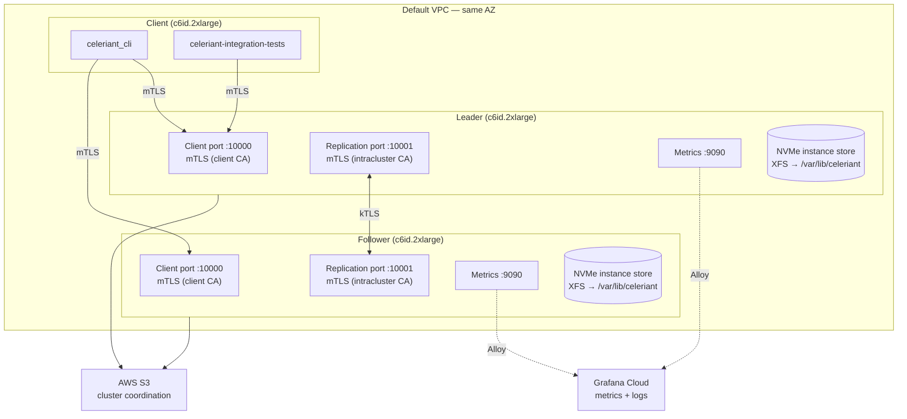
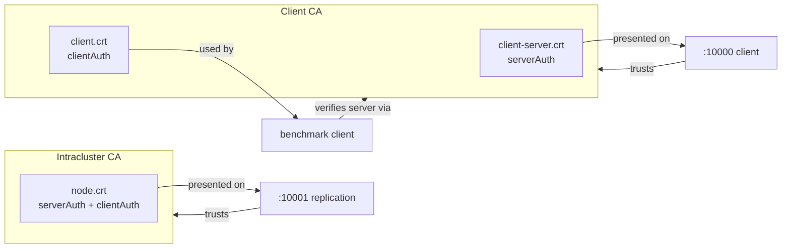

# EC2 kTLS Test Cluster

AWS CDK stack that deploys a Celeriant cluster for investigating the kTLS
internode failure on kernel 6.17. Mirrors the RPi LAN cluster
(`docs/pending/rpi-ktls-testbed.md`) but on EC2 with real S3 and Grafana Cloud.

## Why

kTLS works on the RPi cluster (kernel 6.12) but fails with `EIO` on the local
dev machine (kernel 6.17). This EC2 setup provides:

- Amazon Linux 2023 with kernel 6.1 LTS — a known-stable kTLS baseline
- x86_64 comparison (RPi tests ARM64)
- Isolated network (same AZ, no home router limits)
- NVMe instance storage matching the RPi NVMe setup

If kTLS works on EC2 (6.1) but fails locally (6.17), it confirms a kernel
regression.

## Architecture



### Trust model (dual CA)



A client cert cannot authenticate to the replication port. A node cert cannot
masquerade as a client-facing server.

## Structure

```
deploy/ec2-cluster/
├── bin/ec2-cluster.ts            # CDK app entry point
├── lib/ec2-cluster-stack.ts      # Stack: 3x EC2, S3, SG, IAM, user data
├── scripts/
│   ├── generate-certs.sh         # Dual-CA cert generation with IP SANs
│   └── deploy.sh                 # Deploys binaries, certs, env files to nodes
├── certs/                        # Generated certs (gitignored)
├── cdk.json
└── package.json
```

### What the CDK creates

| Resource | Details |
|---|---|
| 3x EC2 instances | c6id.2xlarge (8 vCPUs, 16GB RAM, 1x 474GB NVMe). 20GB gp3 root EBS for OS only. |
| S3 bucket | `celeriant-ktls-test-<account-id>` — cluster coordination (elections, WAL shipping) |
| Security group | SSH from anywhere, ports 10000/10001/9090 internal only |
| IAM roles | Data nodes: S3 read/write + SSM. Client: SSM only. |

User data on each data node:
- Loads kTLS kernel module
- Sets fd limits (1M) and memlock unlimited
- Detects, formats (XFS), and mounts the NVMe instance store to `/var/lib/celeriant`
- Optionally installs Grafana Alloy for metrics + log shipping

### Context overrides

| Flag | Default | Example |
|---|---|---|
| `instanceType` | `c6id.2xlarge` | `-c instanceType=c6id.4xlarge` |
| `keyPair` | *(none, use SSM)* | `-c keyPair=my-key` |
| `grafanaPromUser` | | `-c grafanaPromUser=123456` |
| `grafanaPromUrl` | | `-c grafanaPromUrl=https://prometheus-prod-XX.grafana.net/api/prom/push` |
| `grafanaLokiUser` | | `-c grafanaLokiUser=123456` |
| `grafanaLokiUrl` | | `-c grafanaLokiUrl=https://logs-prod-XX.grafana.net/loki/api/v1/push` |
| `grafanaApiKey` | | `-c grafanaApiKey=glc_...` |

Grafana Cloud is enabled when `grafanaApiKey`, `grafanaPromUrl`, and
`grafanaLokiUrl` are all set.

### Getting Grafana Cloud credentials

1. Log in to [grafana.com](https://grafana.com) and open your Grafana Cloud
   stack.
2. Go to **Connections > Add new connection > Hosted Prometheus metrics** (or
   navigate to the Prometheus details page for your stack).
   - **Username/Instance ID** → `grafanaPromUser` (a numeric ID like `123456`)
   - **Remote write endpoint** → `grafanaPromUrl` (e.g.
     `https://prometheus-prod-13-prod-us-east-0.grafana.net/api/prom/push`)
3. Go to **Connections > Add new connection > Hosted Logs** (or the Loki details
   page).
   - **Username/Instance ID** → `grafanaLokiUser` (a numeric ID, often the same
     as Prometheus)
   - **Endpoint** → `grafanaLokiUrl` — append `/loki/api/v1/push` to the URL
     shown (e.g.
     `https://logs-prod-006.grafana.net/loki/api/v1/push`)
4. Generate an API key: **Security > API Keys > Add API key** with the
   `MetricsPublisher` role. This single key works for both Prometheus and Loki.
   → `grafanaApiKey` (starts with `glc_...`)

## Deploy

### 1. Build binaries

```bash
cd /home/utilitydelta/work/code/celeriant-db
cargo build --release -p celeriant -p celeriant_integration_tests -p celeriant_cli
```

### 2. Deploy infrastructure

```bash
cd deploy/ec2-cluster

# Without Grafana Cloud
npx cdk deploy -c keyPair=my-key

# With Grafana Cloud
npx cdk deploy \
  -c keyPair=my-key \
  -c grafanaPromUser=YOUR_PROM_USER \
  -c grafanaPromUrl=https://prometheus-prod-XX.grafana.net/api/prom/push \
  -c grafanaLokiUser=YOUR_LOKI_USER \
  -c grafanaLokiUrl=https://logs-prod-XX.grafana.net/loki/api/v1/push \
  -c grafanaApiKey=glc_YOUR_API_KEY
```

Note the private IPs from the stack outputs.

### 3. Generate certs

```bash
./scripts/generate-certs.sh <leader-private-ip> <follower-private-ip> <client-private-ip>
```

### 4. Deploy binaries, certs, env files

```bash
./scripts/deploy.sh --key-file ~/.ssh/my-key.pem
```

This reads IPs from CloudFormation outputs automatically and deploys:
- `celeriant` server binary to leader + follower
- `celeriant-integration-tests` + `celeriant_cli` to client
- Dual-CA certs to all nodes
- Environment files to data nodes

### 5. Start the cluster

```bash
# Terminal 1 — leader
ssh -i ~/.ssh/my-key.pem ec2-user@<leader-public-ip>
set -a && source /tmp/celeriant.env && set +a && celeriant

# Terminal 2 — follower (wait ~5s for leader to grab S3 lease)
ssh -i ~/.ssh/my-key.pem ec2-user@<follower-public-ip>
set -a && source /tmp/celeriant.env && set +a && celeriant
```

## API keys (optional)

API key authentication is **not enabled by default**. The cluster is already
secured by mTLS — only clients with a cert signed by the client CA can connect.

If you want to test with API key auth enabled, generate keys on each data node
after starting the cluster:

```bash
# On leader
ssh -i ~/.ssh/my-key.pem ec2-user@<leader-public-ip>
celeriant keys generate --data-root /var/lib/celeriant
# Prints 4 base64 keys: primary_rw, secondary_rw, primary_ro, secondary_ro
# Copy the key you need — plaintext is shown once and cannot be recovered.
# Restart celeriant to enable auth.
```

Then pass the key on the client:

```bash
# Via CLI flag
celeriant_cli --api-key <base64-key> list-orgs

# Or via env var
export CELERIANT_API_KEY=<base64-key>
celeriant_cli list-orgs
```

Key types:
- `primary_rw` / `secondary_rw` — read and write access
- `primary_ro` / `secondary_ro` — read-only access

Secondary keys exist for zero-downtime rotation: issue the new secondary,
migrate clients, then regenerate the old primary with
`celeriant keys regenerate primary-rw --data-root /var/lib/celeriant`.

For kTLS testing, skip API keys — they're orthogonal to the TLS transport
investigation.

## Testing

SSH to the client node for all testing.

### Smoke test with CLI

```bash
ssh -i ~/.ssh/my-key.pem ec2-user@<client-public-ip>

# Set TLS env vars once
export CELERIANT_SERVER=<leader-private-ip>:10000
export CELERIANT_TLS=true
export CELERIANT_CA_CERT=/etc/celeriant/certs/client-ca.crt
export CELERIANT_CLIENT_CERT=/etc/celeriant/certs/client.crt
export CELERIANT_CLIENT_KEY=/etc/celeriant/certs/client.key

# Write an event
celeriant_cli write \
  --org 1 --type 1 --id 1 \
  --event-type 1 --data '{"hello":"world"}' \
  --allow-create

# Read it back
celeriant_cli read --org 1 --type 1 --id 1

# List organisations
celeriant_cli list-orgs

# Interactive TUI
celeriant_cli
```

### Benchmark (integration tests)

```bash
CELERIANT_TLS_CA_CERT=/etc/celeriant/certs/client-ca.crt \
CELERIANT_TLS_CLIENT_CERT=/etc/celeriant/certs/client.crt \
CELERIANT_TLS_CLIENT_KEY=/etc/celeriant/certs/client.key \
  celeriant-integration-tests batch --address <leader-private-ip>:10000
```

### kTLS test matrix

| # | Config | Expected on 6.1 (EC2) | Compare to 6.17 (local) |
|---|---|---|---|
| 1 | Plaintext (no TLS) | Works | Works |
| 2 | mTLS, dual CA, kTLS | Works? | Fails (EIO) |
| 3 | mTLS, single CA | Works? | Fails (EIO) |

Watch leader logs for heartbeat status:
```
# Success:
kTLS connect: kernel TLS active  fd=42
heartbeat: ok  shard=0

# Failure (what we see on 6.17):
Heartbeat unsuccessful, renewing lease via S3  result=Err(NetworkError(...EIO...))
```

## Logs and metrics

### Without Grafana Cloud

SSH into each data node and check journal logs directly:

```bash
# Follow live
ssh -i ~/.ssh/my-key.pem ec2-user@<node-public-ip> 'journalctl -u celeriant -f --no-pager'

# Last 100 lines
ssh -i ~/.ssh/my-key.pem ec2-user@<node-public-ip> 'journalctl -u celeriant -n 100 --no-pager'

# Errors only
ssh -i ~/.ssh/my-key.pem ec2-user@<node-public-ip> 'journalctl -u celeriant -p err --no-pager'

# Prometheus metrics (raw)
curl http://<node-private-ip>:9090/metrics
```

### With Grafana Cloud

When deployed with Grafana Cloud context values, each data node runs Grafana
Alloy which:

- Scrapes Prometheus metrics from `localhost:9090` every 5s and remote-writes to
  Grafana Cloud
- Ships `celeriant.service` journal logs to Grafana Cloud Loki

In Grafana Cloud:
- **Metrics**: query with `{job="celeriant"}` in Explore (Prometheus datasource)
- **Logs**: query with `{unit="celeriant.service"}` in Explore (Loki datasource),
  filter by `node` label to distinguish leader/follower

## Teardown

```bash
cd deploy/ec2-cluster
npx cdk destroy
```

This removes all instances, the S3 bucket (and its contents), the security
group, and IAM roles. The default VPC is untouched.

NVMe instance store data is ephemeral and destroyed with the instance.

## Cost

c6id.2xlarge on-demand: ~$0.45/hr each, ~$1.35/hr for the cluster. A full
investigation session (1-2 hours) costs ~$2-3. Spot pricing is roughly 60-70%
cheaper.
