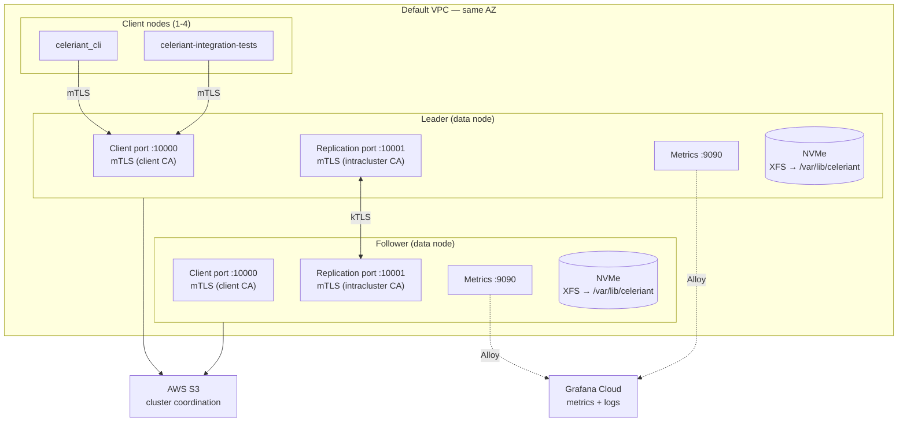

# EC2 Performance Test Cluster

AWS CDK stack that deploys a Celeriant cluster for performance benchmarking
and kTLS testing. Mirrors the RPi LAN cluster (`deploy/rpi-cluster`) with a
Makefile-driven workflow, systemd services, and automated benchmark collection.

## Architecture



## Instance type flexibility

Use `-c instanceType=...` for data nodes and `-c clientInstanceType=...` for the benchmark
client(s). **Instance store (NVMe) is required for data nodes** — Glommio's io_uring does not
work reliably with EBS volumes (WAL open hangs). Client nodes only need CPU (no disk I/O),
so compute-optimized instances work well.

Architecture (x86_64 vs ARM64) is auto-detected from the instance type family. ARM families
(i4g, c7g, etc.) get an ARM AMI; all others get x86_64. Data and client nodes must match
architecture — use `make build` for x86_64 or `make build-arm` for ARM.

### Data node instance types

| Use case | Instance | vCPU | NVMe | $/hr per node |
|---|---|---|---|---|
| Cheap smoke test | `c6id.xlarge` | 4 | 1x 237GB | ~$0.22 |
| Standard benchmark | `c6id.2xlarge` | 8 | 1x 474GB | ~$0.45 |
| Storage-optimized (8c) | `i4i.2xlarge` | 8 | 1x 468GB | ~$0.72 |
| Storage-optimized (16c) | `i4i.4xlarge` | 16 | 1x 937GB | ~$1.44 |
| **Storage-optimized (32c)** | **`i4i.8xlarge`** | **32** | **2x 1875GB Nitro SSD** | **~$3.60** |
| Storage-optimized ARM (8c) | `i4g.2xlarge` | 8 | 1x 468GB | ~$0.58 |
| Storage-optimized ARM (16c) | `i4g.4xlarge` | 16 | 1x 937GB | ~$1.15 |
| Storage-optimized ARM (32c) | `i4g.8xlarge` | 32 | 2x 1875GB Nitro SSD | ~$2.88 |

### Client node instance types

The client runs the tokio-based benchmark (`rpi_cluster_pool_bench`) which scales across
all available cores. Use compute-optimized instances to avoid bottlenecking the benchmark.
Multiple clients can be deployed with `-c clientCount=N` (max 4) to eliminate client-side
bottlenecks at high concurrency — tasks are split evenly across clients.

| Use case | Instance | vCPU | $/hr |
|---|---|---|---|
| Match data nodes | *(same as instanceType)* | — | — |
| Compute-optimized x86 | `c7i.4xlarge` | 16 | ~$0.97 |
| Compute-optimized x86 (large) | `c7i.8xlarge` | 32 | ~$1.93 |
| Compute-optimized ARM | `c7g.4xlarge` | 16 | ~$0.78 |
| Compute-optimized ARM (large) | `c7g.8xlarge` | 32 | ~$1.56 |

> **Warning:** Do not use EBS-only instance types (t3, m5, c5) for data nodes or `-c storageType=ebs`.
> Glommio's io_uring poll ring fails on EBS, causing the server to start but never
> accept connections. The CDK stack still supports EBS config for potential future fixes,
> but it is not currently functional.

## Prerequisites

1. **AWS CLI configured** — run `aws configure` or `aws sso login`
2. **SSH key pair imported** — import your key into AWS:
   ```bash
   aws ec2 import-key-pair --key-name my-key --public-key-material fileb://~/.ssh/id_rsa.pub
   ```
3. **CDK bootstrapped** (one-time per account/region):
   ```bash
   cd deploy/ec2-cluster && npm install && npx cdk bootstrap
   ```
4. **Docker** — required for building binaries. A local `cargo build --release` produces binaries
   linked against your system's glibc, which is newer than Amazon Linux 2023's glibc 2.34.
   The binary will fail with `GLIBC_2.XX not found` on EC2. The `make build` / `make build-arm`
   targets run the build inside an `amazonlinux:2023` Docker container so the binary links
   against the correct glibc. For ARM builds, QEMU binfmt is used to emulate aarch64 (~15-40 min
   first build, seconds on subsequent builds if deps are cached).

## Quick start

```bash
cd deploy/ec2-cluster

# 1. Build binaries in Docker (local builds won't work — glibc mismatch)
make build          # x86_64 (c6id, i4i, c7i)
make build-arm      # ARM64 (i4g, c7g) — requires QEMU binfmt
# ⚠️ Both targets output to target/release/ — building one overwrites the other.
#    Always rebuild before deploying if you switched architecture.

# 2. Deploy infrastructure (NVMe instance store required — see instance types above)
make infra CDK_ARGS="-c keyPair=my-key"

# Storage-optimized with separate compute-optimized client:
make infra CDK_ARGS="-c keyPair=my-key \
  -c instanceType=i4i.8xlarge \
  -c clientInstanceType=c7i.4xlarge"

# Multi-client for high concurrency testing (tasks split across clients):
make infra CDK_ARGS="-c keyPair=my-key \
  -c instanceType=i4i.8xlarge \
  -c clientInstanceType=c7i.4xlarge \
  -c clientCount=3"

# ARM variant (20% cheaper):
make infra CDK_ARGS="-c keyPair=my-key \
  -c instanceType=i4g.8xlarge \
  -c clientInstanceType=c7g.4xlarge \
  -c clientCount=3"

# 3. Generate certs and deploy everything
make certs
make deploy KEY_ARG="--key-file ~/.ssh/id_rsa"

# 4. Start and benchmark
make start
make run-benchmark                                    # default: 8000 tasks
make run-benchmark BENCH_TASKS=36000 BENCH_CONNS=12000  # high concurrency sweep
make stop
```

## Structure

```
deploy/ec2-cluster/
├── Makefile                     # Orchestration (mirrors rpi-cluster)
├── bin/ec2-cluster.ts           # CDK app entry point
├── lib/ec2-cluster-stack.ts     # Stack: 2 data + N client EC2, S3, SG, IAM, user data
├── scripts/
│   ├── generate-certs.sh        # Dual-CA cert generation with IP SANs
│   ├── deploy.sh                # Deploys binaries, certs, env files to all nodes
│   ├── run-benchmark.sh         # Runs benchmark on client(s), aggregates results
│   └── deploy-dashboard.sh      # Imports Celeriant dashboard to Grafana Cloud
├── certs/                       # Generated certs (gitignored)
├── results/                     # Benchmark results (gitignored)
├── .cluster-env                 # Cached IPs/config (gitignored, written by deploy.sh)
├── cdk.json
└── package.json
```

## Day-to-day commands

```bash
make help              # Show all targets
make build             # Build x86_64 binaries in Docker
make build-arm         # Build ARM64 binaries in Docker (QEMU)
make infra             # Deploy CDK stack
make certs             # Generate TLS certificates
make deploy            # Deploy binaries, certs, env files
make start             # Start cluster (leader first)
make stop              # Stop cluster
make restart           # Stop then start
make status            # Check service status
make logs              # Tail logs from both nodes (Ctrl+C to stop)
make run-benchmark     # Run benchmark and save results
make dashboard         # Import Celeriant dashboard to Grafana Cloud
make sync-env          # Re-read CDK outputs into .cluster-env
make teardown          # Stop cluster + destroy CDK stack
make teardown-data     # Wipe data on data nodes
```

### Benchmark configuration

The benchmark runs `rpi_cluster_pool_bench` — a pool-based write benchmark with
automatic leader failover, connecting to both nodes (same test the RPi cluster uses).

With multiple clients (`-c clientCount=N`), total tasks are split evenly across clients
and run in parallel. Results are aggregated (requests summed, per-client stats shown).

Override defaults via Make variables:

```bash
make run-benchmark BENCH_TASKS=4000 BENCH_CONNS=4000 BENCH_DURATION=30
```

Results are saved to `results/<timestamp>_<instance-type>_<storage-type>.txt` with
metadata headers for easy comparison across instance types.

### CDK context overrides

| Flag | Default | Example |
|---|---|---|
| `instanceType` | `c6id.2xlarge` | `-c instanceType=i4i.8xlarge` |
| `clientInstanceType` | *(same as instanceType)* | `-c clientInstanceType=c7i.4xlarge` |
| `clientCount` | `1` | `-c clientCount=3` (max 4) |
| `storageType` | `instance-store` | ⚠️ `ebs` exists but is broken (see above) |
| `ebsDataVolumeSize` | `100` (GB) | `-c ebsDataVolumeSize=200` (EBS only) |
| `keyPair` | *(none, use SSM)* | `-c keyPair=my-key` |
| `grafanaPromUser` | | `-c grafanaPromUser=123456` |
| `grafanaPromUrl` | | `-c grafanaPromUrl=https://prometheus-prod-XX.grafana.net/api/prom/push` |
| `grafanaLokiUser` | | `-c grafanaLokiUser=123456` |
| `grafanaLokiUrl` | | `-c grafanaLokiUrl=https://logs-prod-XX.grafana.net/loki/api/v1/push` |
| `grafanaApiKey` | | `-c grafanaApiKey=glc_...` |

## Trust model (dual CA)

Same as rpi-cluster — two CAs isolate client and intracluster traffic:

- **Intracluster CA** signs `node.crt` (serverAuth + clientAuth) → presented on port 10001
- **Client CA** signs `client-server.crt` (serverAuth) → presented on port 10000
- **Client CA** signs `client.crt` (clientAuth) → used by benchmark client

A client cert cannot authenticate to the replication port.

## RPi comparison

| Aspect | RPi cluster | EC2 cluster |
|---|---|---|
| Nodes | 2x RPi 5 + RPi 4 infra | 2x EC2 data + 1-4 EC2 clients |
| Storage | NVMe HAT | NVMe instance store |
| S3 | MinIO on infra node | AWS S3 |
| Monitoring | Self-hosted Grafana/Prometheus/Loki | Grafana Cloud (optional) |
| Dashboard | Auto-provisioned from local-cluster | `make dashboard` imports same JSON |
| Network | LAN switch | Same AZ (LAN-equivalent) |
| Service mgmt | systemd | systemd |
| Orchestration | Makefile | Makefile |
| Build | Cross-compile ARM64 | Docker (amazonlinux:2023) |
| Benchmark | `make run-test` (from dev machine) | `make run-benchmark` (from client EC2) |

## OS tuning

The CDK user data automatically configures all nodes with:

- `fs.file-max = 1048576` — max open file descriptors
- `net.ipv4.ip_local_port_range = 1024 65535` — full ephemeral port range (~64k ports)
- `net.core.somaxconn = 65535` — max listen backlog
- `nofile` soft/hard limits at 1048576
- `memlock` unlimited (required for io_uring)
- kTLS kernel module loaded

These are persisted to `/etc/sysctl.d/99-celeriant.conf` and `/etc/security/limits.d/celeriant.conf`.

## Testing

### Smoke test with CLI

```bash
ssh -i ~/.ssh/id_rsa ec2-user@<client-public-ip>
export CELERIANT_SERVER=<leader-private-ip>:10000
export CELERIANT_TLS=true
export CELERIANT_CA_CERT=/etc/celeriant/certs/client-ca.crt
export CELERIANT_CLIENT_CERT=/etc/celeriant/certs/client.crt
export CELERIANT_CLIENT_KEY=/etc/celeriant/certs/client.key

celeriant_cli write --org 1 --type 1 --id 1 --event-type 1 --data '{"hello":"world"}' --allow-create
celeriant_cli read --org 1 --type 1 --id 1
```

### Logs and metrics

Without Grafana Cloud:
```bash
make logs                          # Tail both nodes
ssh ec2-user@<node> 'journalctl -u celeriant -n 100 --no-pager'
```

With Grafana Cloud (set `grafanaApiKey`, `grafanaPromUrl`, `grafanaLokiUrl`):
- Metrics: `{job="celeriant"}` in Prometheus
- Logs: `{unit="celeriant.service"}` in Loki

Import the same Celeriant cluster dashboard used by the RPi and local clusters:
```bash
make dashboard GRAFANA_URL=https://your-stack.grafana.net GRAFANA_TOKEN=glsa_...
```

The `GRAFANA_TOKEN` needs Editor or Admin role — the `MetricsPublisher` key used
by Alloy is not sufficient. Create a Service Account token in Grafana Cloud under
**Administration > Service Accounts**.

## Teardown

```bash
make teardown    # Stops services + destroys stack
```

NVMe instance store data is ephemeral. EBS data volumes are destroyed with the stack.

## Benchmark results

See `docs/ec2-benchmark-results-2026-03-24.md` for single-client results across 6 configurations
and `docs/ec2-3client-benchmark-2026-03-24.md` for multi-client performance curves.

Peak observed: **374,552 durable replicated writes/sec** on i4i.8xlarge (x86, 32 vCPU) with 3 clients.
