# Leadership & Replication Design

*WARNING - LLM Synthesised From Codebase - Pending Human Review*

## Celeriant

Celeriant is a distributed, append-only event store built for the write side of
event sourcing. Rust, thread-per-core (Glommio/io_uring), Direct I/O, one WAL
per shard. Two-node clusters with S3 for coordination and fallback replication.
Every write is fsynced to disk on both nodes before the client gets an ACK. No
write is ever acknowledged until it exists on two storage systems.

## S3 Conditional Writes as a Consensus Protocol

Celeriant does not use Raft or Paxos. Leader election and coordination run
entirely through S3 conditional writes (CAS on a single `cluster/lease.json`
object using etag-based preconditions). A monotonically increasing `lease_index`
prevents ABA races. Nodes self-fence via asymmetric TTLs: the leader fences
early (at `expires_at - max_clock_drift`), the follower challenges late (at full
`expires_at`), guaranteeing the leader stops writing before the follower can win
an election. S3 also serves as a fallback replication target when the follower is
unreachable, so it functions as both the coordination plane and the durability
safety net. The trade-offs are explicit: clock dependency (bounded by
`max_clock_drift_ms`), a hard two-node ceiling, ~1.5s failover latency, and an
external object store dependency during partitions. In exchange, there is no
third node, no log matching, no pre-vote protocol, no joint consensus for
membership changes, and zero coordination traffic on the write path during
healthy steady-state operation.

This document is the implementation specification for Celeriant's cluster
coordination, leadership election, and data replication. Sufficient detail to
re-implement from scratch.

---

## Node States

```
Standalone ──────────────────────────────────────────────────────
BootCatchup ──► Leader    BootCatchup ──► Follower
Leader ──► Follower       Leader ──► Fenced
Follower ──► FollowerCatchingUp ──► Follower
Follower ──► Fenced ──► Leader / Follower / BootCatchup
```

**Invalid transitions:**
- `FollowerCatchingUp` cannot go directly to `Leader` (must return to `Follower` first)
- `BootCatchup` cannot go to `FollowerCatchingUp` (different entry points)

**TTL decay:**
- `Leader` and `Follower` decay to `Fenced` when `now > expires_at - max_clock_drift`
- `BootCatchup` and `FollowerCatchingUp` are TTL-exempt (never decay)
- Only `Leader` and `Standalone` accept writes

---

## Leader Election

S3 holds a single `cluster/lease.json` object. No Raft, no quorum. Election is a
conditional PUT (CAS) on this object using its etag.

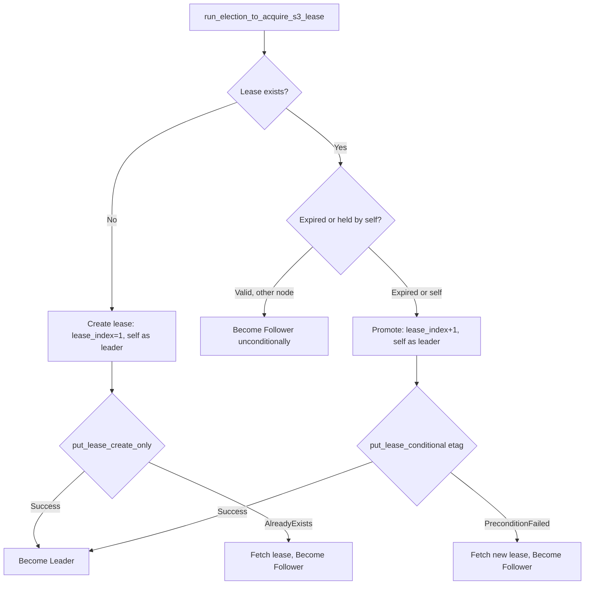

**Key property:** A node seeing a valid unexpired lease from another node becomes
follower without attempting CAS. Only expired or self-held leases trigger a race.

`lease_index` is strictly monotonic and never reused.

**Election return value:** `ElectionOutcome { status: ValidatedNodeStatus, peer_info: Option<NodeInfo> }`.
The status is `Leader` or `Follower` with TTL set from the S3 lease. `peer_info`
contains the other node's client and replication addresses from the S3 membership
object (may be `None` if no peer registered yet).

---

## S3 Object Layout

All cluster state lives under a single S3 prefix:

```
cluster/
├── lease.json                  (leader lease, CAS-protected)
├── membership.json             (2-slot node registry)
└── fallback/
    ├── shard_000/
    │   └── batch_{start:09}_{end:09}_{node_uuid}.bin
    ├── shard_001/
    │   └── ...
    └── ...
```

**Lease object** (`cluster/lease.json`): JSON-serialized.
Fields: `leader_node_id` (u128), `lease_index` (u64), `acquired_at_ms` (u64),
`expires_at_ms` (u64).

**Membership object** (`cluster/membership.json`): JSON-serialized.
Fixed 2-slot array: `nodes: [Option<NodeInfo>; 2]`. A third node cannot join.
Each `NodeInfo` contains: `node_id` (u128), `client_address` (String),
`replication_address` (String).

**Fallback batch objects**: Bincode-serialized with 8-byte header
(`[CRC32C 4B LE] [Version 4B LE]`, version = 1). Filename encodes shard ID
(3-digit zero-padded), WAL index range (9-digit zero-padded), and uploader
node ID (UUID format). Zero-padding ensures lexicographic ordering matches
temporal ordering.

---

## Heartbeat Protocol

Heartbeats flow leader-to-follower only, handled exclusively on shard 0. The
leader sends every `heartbeat_interval` (default 500ms). The follower extends its
TTL on each received heartbeat.

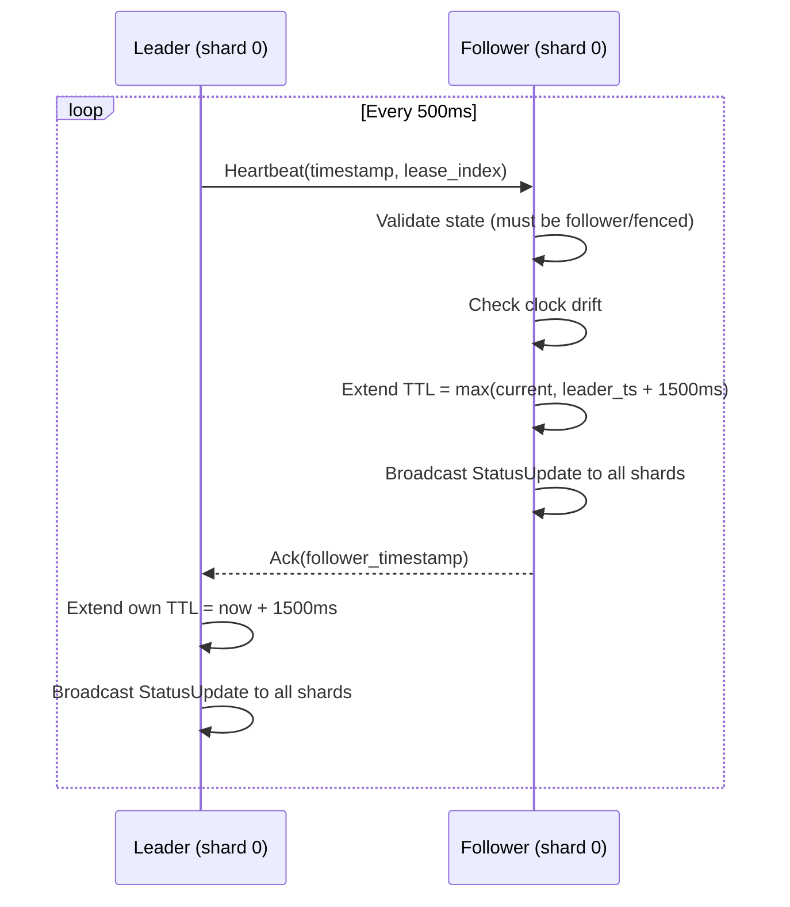

**Asymmetric fencing:**
- Leader fences early: `now > expires_at - max_clock_drift` (~1000ms before expiry)
- Follower challenges late: waits for full `expires_at` expiry (~1500ms)
- This gap ensures the leader self-fences before the follower can win an election

**Heartbeat failure path (leader side):**
- No peer known: exponential backoff peer discovery (1s, 2s, 4s, capped at `s3_lease_duration / 2`)
- Peer known but unreachable: check S3 only when `lease_time_remaining <= s3_lease_duration / 2`
- While TCP heartbeats succeed, S3 lease is never renewed (cost saving)

---

## Connection Management

The leader maintains **two separate TCP connections** to the follower, each with
its own lock. This prevents replication traffic from starving heartbeats and
vice versa.

**Replication connection:**
- Used for: batch replication, kick messages
- Reuse: persistent across batches within a replication cycle, reset only on error
- Timeouts: `connection_timeout` for TCP establishment, `request_timeout` per request

**Heartbeat connection:**
- Used for: heartbeat messages only
- Reuse: **always resets** (fresh TCP connection every attempt)
- Timeout: `heartbeat_timeout` applies to both connection and request
- Rationale: a stale connection could block for `request_timeout` (10s) when the
  peer is unreachable, preventing timely self-fencing

**Address discovery:** The leader discovers the follower's replication address
from the S3 membership object after election, not from heartbeat responses.
Each node registers itself on the membership object at boot.

---

## Boot Sequence

Every non-standalone node starts in `BootCatchup` state. The boot orchestrator
runs exclusively on shard 0 and drives the node from boot to steady state.

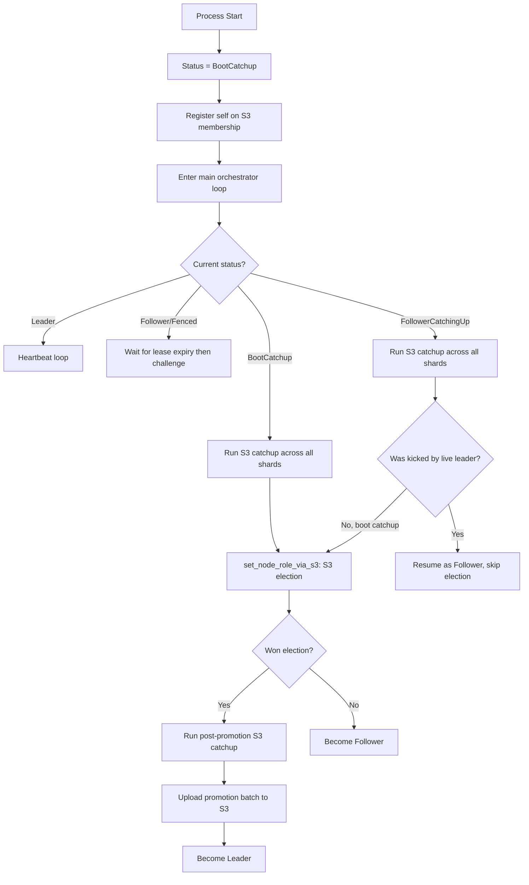

**Client connections are accepted immediately at boot.** Reads work at any time
(serving stale data). Writes are rejected with `WRITE_NOT_LEADER` until the node
reaches `Leader` or `Standalone`.

**Standalone mode** bypasses the boot orchestrator entirely. The node starts in
`Standalone` state and accepts writes immediately. No S3, no replication.

### Post-Election Processing

When `set_node_role_via_s3` completes, it performs these steps in order:

1. Record election metrics
2. Broadcast `UpdatePeerNodeId` to all shards (used to filter S3 batches)
3. If promoted to leader: run S3 catchup (safety check), upload promotion batch
4. Set leader/follower client and replication addresses
5. Broadcast `UpdateLeaderClientAddress` and `UpdateFollower` to all shards
6. Activate new node status and broadcast `StatusUpdate` to all shards

---

## Shard 0 Coordination Protocol

Shard 0 orchestrates all cluster-wide operations through an intrashard message
mesh. Messages are sent via bounded channels with retry (10 attempts).

**Intrashard message types:**

| Message | Direction | Purpose |
|---------|-----------|---------|
| `EnterS3Catchup` | Shard 0 → all | Start S3 catchup on each shard |
| `S3CatchupComplete` | All → shard 0 | Report catchup result per shard |
| `StatusUpdate` | Shard 0 → all | Broadcast role/TTL changes |
| `UpdatePeerNodeId` | Shard 0 → all | Share discovered peer node ID |
| `UpdateFollower` | Shard 0 → all | Share follower replication address |
| `UpdateLeaderClientAddress` | Shard 0 → all | Share leader client address for redirects |
| `Shutdown` | Shard 0 → all | Initiate graceful shutdown |

**S3 catchup orchestration:**

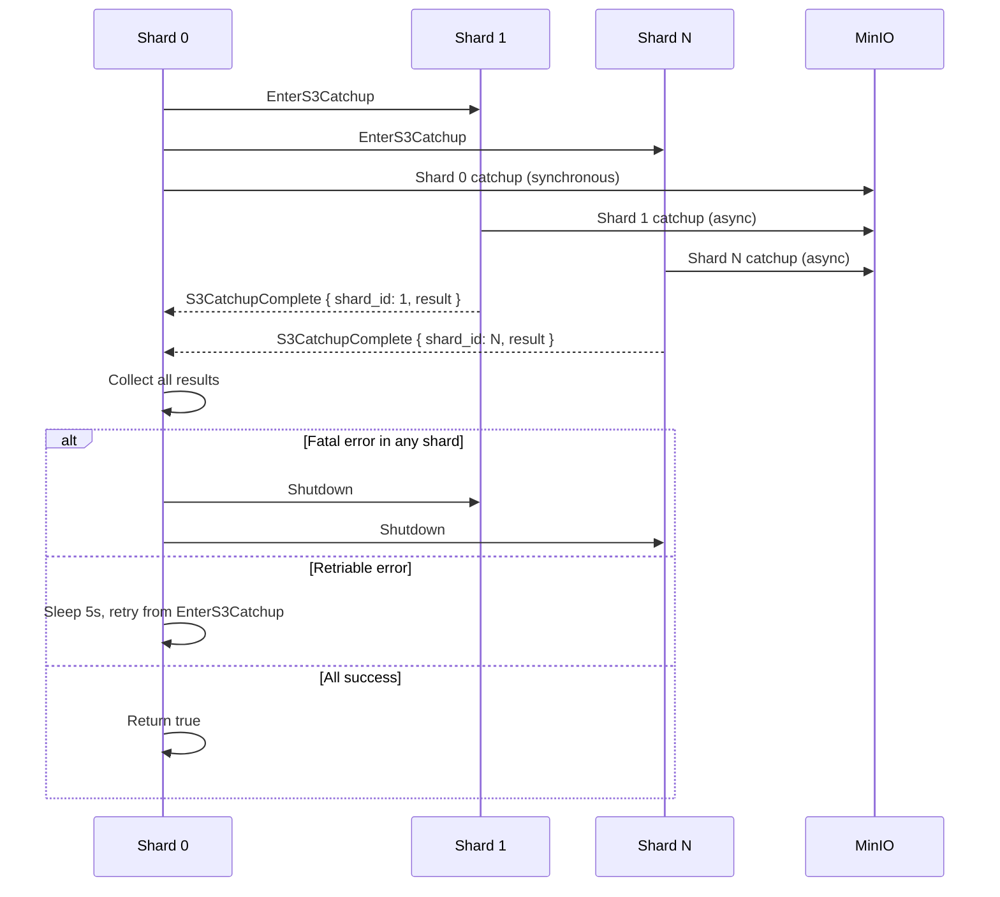

Shard 0 performs its own catchup synchronously, then collects results from all
other shards via a channel. Fatal errors trigger cluster shutdown. Retriable
errors (transient S3 failures) retry after 5 seconds.

**Shard 0 isolation (`reserve_coordinator_shard`):**
- When enabled, shard 0 does not bind a client TCP listener
- Client routing: `routing_id % (num_shards - 1) + 1` (skips shard 0)
- Shard 0 handles: heartbeat, kick, schema registration, intrashard messages
- Prevents write load from starving the heartbeat task

---

## Write Pipeline

A client write passes through four sequential phases. The client ACK is withheld
until all four complete.

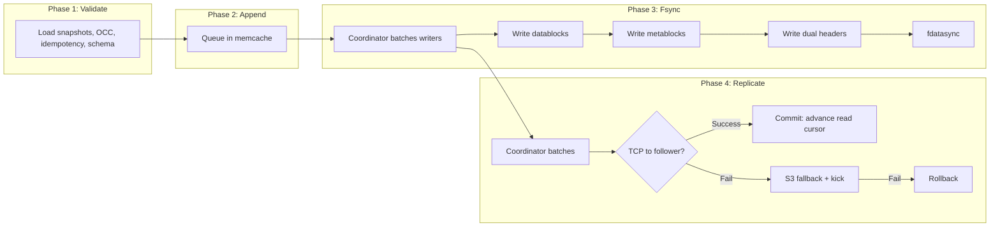

**Fsync coordinator (two-phase):**
1. First writer becomes leader, sleeps `fsync_delay` (17ms) for batching
2. Subsequent writers become followers, share the result
3. Leader captures snapshot, clears orchestrator, acquires `sync_gate`, fsyncs
4. `sync_gate` ensures one fsync at a time

**Visibility:**
- After fsync on leader: data is on disk but invisible to readers (in `pending_replication_batches`)
- After replication commit: read cursor advances, data visible to readers
- After fsync on follower/standalone: data immediately visible (read cursor advances in fsync)

---

## Replication Capture, Send, and Commit

Phase 4 (Replicate) has three distinct sub-phases. Understanding these is critical
for getting visibility semantics right.

### Capture

After fsync, each batch is pushed to `pending_replication_batches` in the memcache.
The replication coordinator uses the same two-phase pattern as fsync: first writer
sleeps `replication_delay`, subsequent writers share the result.

The capture function drains the entire queue atomically (`std::mem::take`), then
checks state in this exact order:

1. Take snapshot (drain `pending_replication_batches`, reset `pending_replication_bytes` to 0)
2. Check rollback flag (if set, return `Failed(RollbackInProgress)`)
3. Check if snapshot is empty (if so, return `NoCaptureRaceButOk`)

**The ordering matters.** Checking the rollback flag after the drain distinguishes
"empty because idle" from "empty because rollback cleared it". The two-phase
capture pattern (capture while orchestrator event is held, clear orchestrator,
then process) prevents a race where a new coordinator leader finds an empty queue.

**Capture result:**
- `Captured(data)`: proceed to send
- `Failed(RollbackInProgress)`: previous replication failed and rolled back
- `NoCaptureRaceButOk`: empty queue, harmless race

**What gets captured:** `PendingCommitData` per fsync batch, containing:
- `log_metadata`: the log segment's write cursor position at fsync time
- `pending_queue`: vector of `PendingCacheItem` (metablock + datablock pairs)

The `pending_replication_batches` queue is intentionally unbounded. Queue pressure
is detected via `pending_replication_bytes > pending_replication_high_water_bytes`,
which triggers S3 fallback at the replication coordinator level.

### Send

The send phase is the TCP replication and S3 fallback logic described in the
following sections. This is where the captured batches are transmitted to the
follower or uploaded to S3.

### Commit

After successful replication (TCP or S3), the commit phase makes data visible
to readers. Steps in order:

1. **Advance read cursor per-segment:** For each batch, copy the write cursor
   to the read cursor: `metadata.read = Some(commit_data.log_metadata.write.clone())`.
   Only updates cached log segments.

2. **Update caches per-item:** For each metablock in the batch:
   - `EventBatchMetadata`: update segment summary, commit position to read snapshot,
     cache recent write with metablock and datablock data
   - `SoftTrim`: update aggregate min event batch index on both write and read paths
   - `SoftDelete`: mark aggregate as deleted in read snapshot cache
   - `SchemaRegistration`: no action

3. **Finalize sealed segments:** If a non-active log segment is now fully replicated
   (`read.wal_index == write.wal_index`), extract its sealed segment summary from
   memcache for sidecar file write. This is best-effort (errors logged, not fatal).

4. **Broadcast watch events:** Events are collected during step 2 and broadcast
   in fixed order: Create, Write, Delete, Trim. Watch events only fire after
   durable replication on the leader (or after fsync on non-leader).

---

## TCP Replication (Leader to Follower)

The replication coordinator batches pending writes, then attempts TCP replication
in paginated chunks bounded by `max_request_size`.

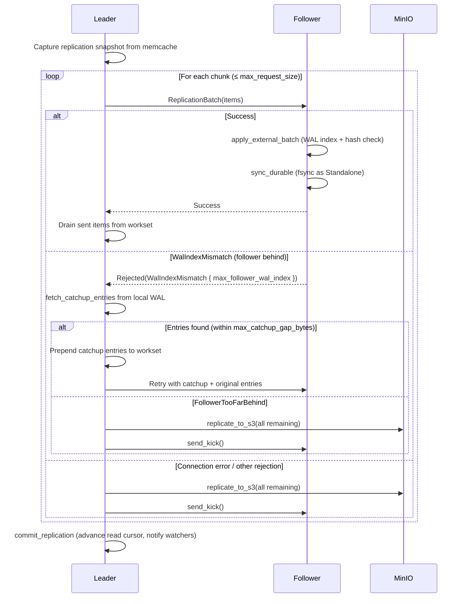

**Follower validation on receive:**
1. WAL index continuity: `current + 1 == batch[0].wal_index`
2. Hash chain: `current_tip_hash == batch[0].previous_tip_hash`
3. Batch internal contiguity: each item's WAL index is previous + 1
4. Lease index: `batch.lease_index >= follower.leader_lease_index`

**After successful TCP receive, the follower records `last_received_replication_wal_index`
in the log segment header.** This survives crashes and is used during promotion to
upload the batch to S3 (see Promotion Batch Upload below).

**Authentication:** mTLS on the replication port (always required, hardcoded).
Per-request `lease_index` validation prevents stale leaders from overwriting data.
No separate API key or token for replication.

---

## S3 Fallback Replication

When TCP replication fails (follower offline, too far behind, or connection error),
the leader uploads the batch to MinIO as a `FallbackBatch`. Each batch is a single
S3 object named by shard, WAL range, and uploader node ID.

**Triggers:**
- Follower offline (TCP connection fails)
- `workset_size_bytes > max_catchup_gap_bytes` (follower falling behind)
- `pending_replication_bytes > pending_replication_high_water_bytes` (queue pressure)
- Second TCP rejection after catchup retry

**After successful S3 upload, the leader sends a kick** (at most once per replication
cycle). The kick transitions the follower from `Follower` to `FollowerCatchingUp`.

**FallbackBatch structure:**
- `fallback_index` (u64): first WAL index in the batch
- `end_wal_index` (u64): last WAL index in the batch
- `shard_id` (u32)
- `uploaded_by_node_id` (u128)
- `items`: Vec of (metablock, optional datablock) pairs

---

## Kick and Catchup Flow

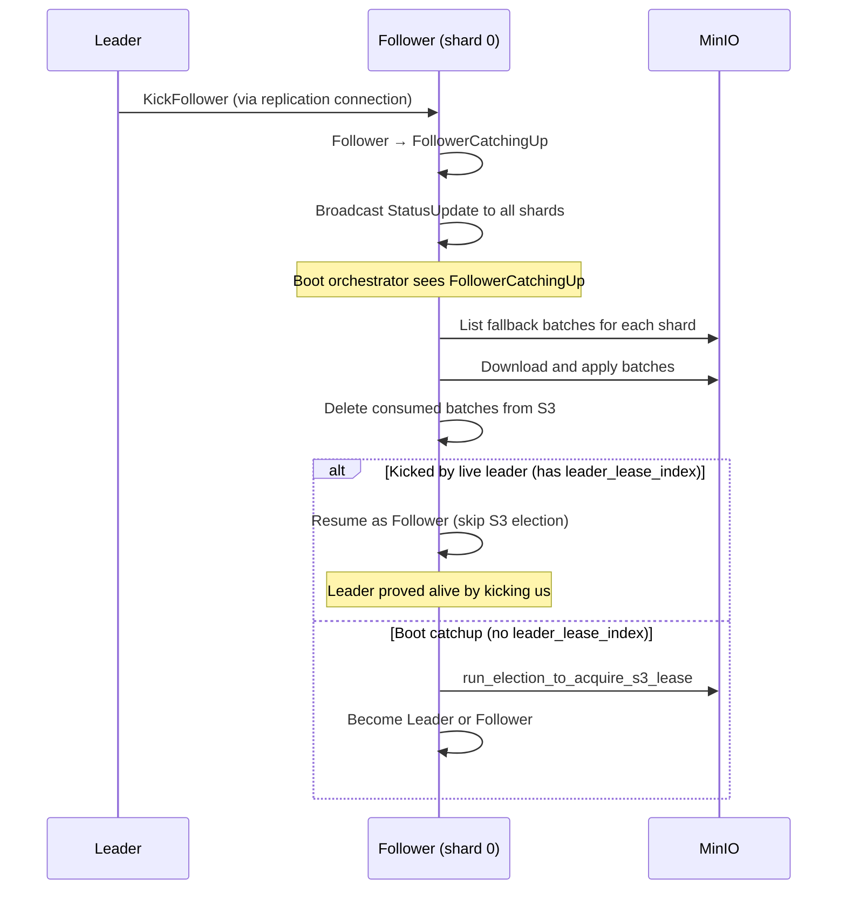

**Kick message:** A minimal request (`KickFollowerRequest` with only a correlation ID),
sent on the **replication connection** (not heartbeat). Returns `acknowledged: bool`.
A non-follower node rejects with `acknowledged: false`.

**FollowerCatchingUp vs BootCatchup:**

| Aspect | BootCatchup | FollowerCatchingUp |
|--------|-------------|-------------------|
| When set | Process start | Leader sends kick |
| Carries leader_lease_index | No | Yes |
| Post-catchup action | S3 election | Resume as Follower |
| TTL behavior | Exempt | Exempt |

**S3 catchup per-shard:**
1. List S3 objects, filter by peer node ID (ignore self-uploads and stale generations)
2. Deduplicate: same start index, keep largest end index
3. Validate inter-batch contiguity: `batch[i].end + 1 == batch[i+1].start`
4. For each batch: download, skip already-applied entries, apply, fsync, delete from S3
5. On `TipHashMismatch`: find divergence point, truncate local WAL, retry
6. On `WalIndexMismatch` (batch starts ahead): defer to TCP replication

---

## Rollback

Rollback fires when both TCP and S3 replication fail. The leader cannot durably
replicate the batch, so it rewinds to the last replicated state.

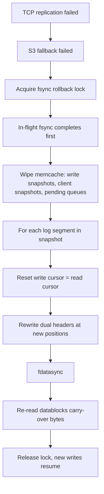

**Key properties:**
- Rollback lock blocks all new writers. In-flight fsyncs complete before lock is granted.
- Write cursor resets to read cursor (or file start if segment never replicated).
- Dual headers are rewritten and fsynced before lock release. Rollback is durable.
- After rollback, the node accepts writes immediately.
- Rollback flags (`fsync_rollback_occurred`, `replication_rollback_occurred`) are set
  and consumed once by the next capture phase.

---

## Promotion Batch Upload

Covers a specific partition scenario where a TCP-replicated batch exists on the
follower but was rolled back by the leader and never uploaded to S3.

**Scenario:**
1. Leader writes batch X, TCP-replicates to follower, follower fsyncs and ACKs
2. Network partition: leader cannot reach follower or S3
3. Leader rolls back batch X (both paths failed)
4. Follower keeps batch X (received and fsynced before partition)
5. Leader's S3 lease expires, follower wins election
6. Follower becomes leader, starts writing X+1, X+2... (S3 fallback since old leader offline)
7. S3 has X+1, X+2... but NOT X
8. Old leader rejoins, enters S3 catchup: gap at X

**Fix:** On promotion to leader, upload the last TCP-received batch to S3 before
accepting writes. The field `last_received_replication_wal_index` tracks which
batch needs uploading.

**Limitation:** Only fires on leadership change. If the original leader stays
leader, the gap between TCP-replicated and S3-uploaded entries is not backfilled.
The follower handles this via `WalIndexMismatch` deferral to TCP replication.

---

## Boot Orchestrator Steady-State Loops

After boot completes, the orchestrator loop continues running on shard 0.
The loop has four mutually exclusive branches based on current node status.

### Leader Steady State

```
loop {
    sleep(heartbeat_interval)                           // 500ms default
    send_heartbeat(timestamp, lease_index)

    if Ack:
        has_peer = true
        reset peer_discovery_backoff to 1s
        extend own TTL = now + heartbeat_lease_duration
        broadcast StatusUpdate to all shards
        continue                                        // skip S3 check

    // Heartbeat failed
    increment heartbeat_failures counter

    if no peer known:
        should_check_s3 = backoff elapsed               // 1s, 2s, 4s... capped
    else (peer known but unreachable):
        should_check_s3 = lease_remaining < half_s3_lease OR expired

    if !should_check_s3: continue                       // retry next interval

    set_node_role_via_s3()                              // S3 lease renewal/election
    update peer_discovery_backoff
}
```

### Follower Steady State

```
loop {
    check effective status (may auto-fence if TTL expired)
    remaining = lease_expires_at - now
    sleep(min(remaining, 500ms))                        // 500ms cap for shutdown

    if lease was refreshed by heartbeat handler: continue
    if status changed (e.g., kicked): continue

    // Lease expired, leader presumed dead
    set_node_role_via_s3()                              // challenge for leadership
}
```

The follower's heartbeat reception happens on a separate task (the TCP connection
handler on shard 0), not in the orchestrator loop. The handler extends the TTL
and broadcasts the status update. The orchestrator loop only detects expiry.

---

## Component Interaction

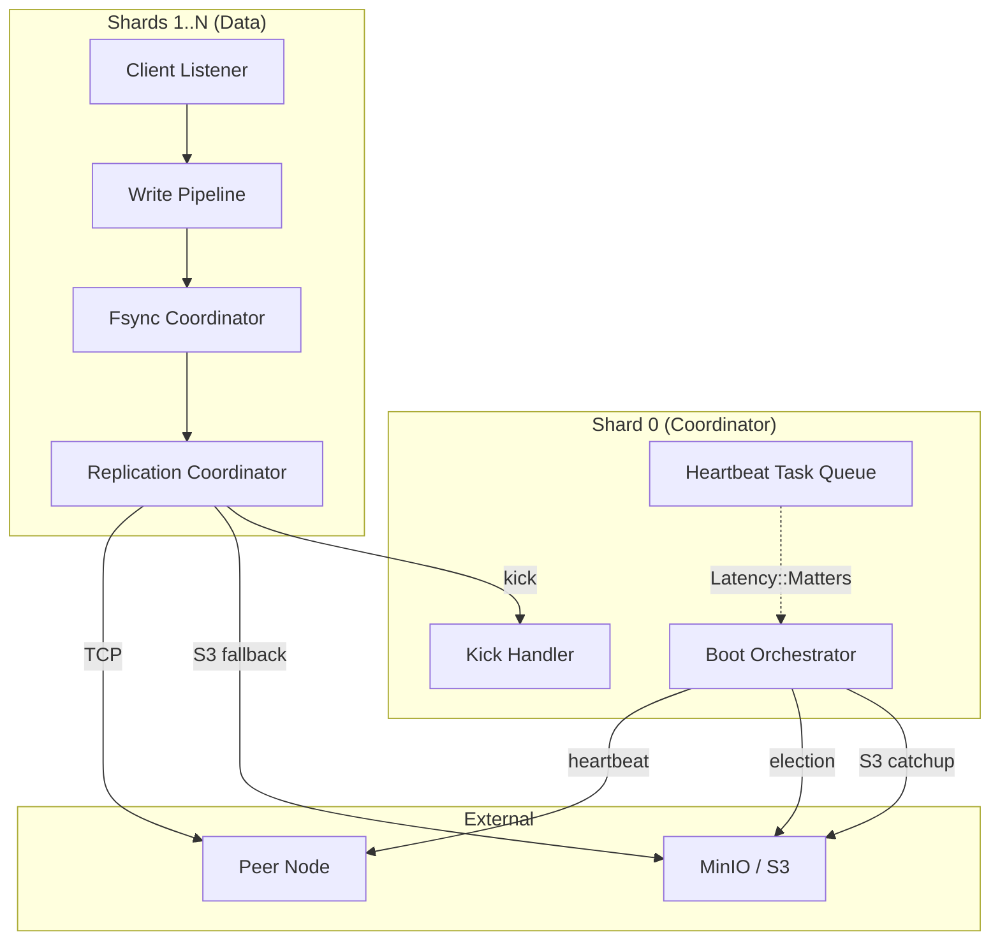

---

## Timeline: Normal Operation

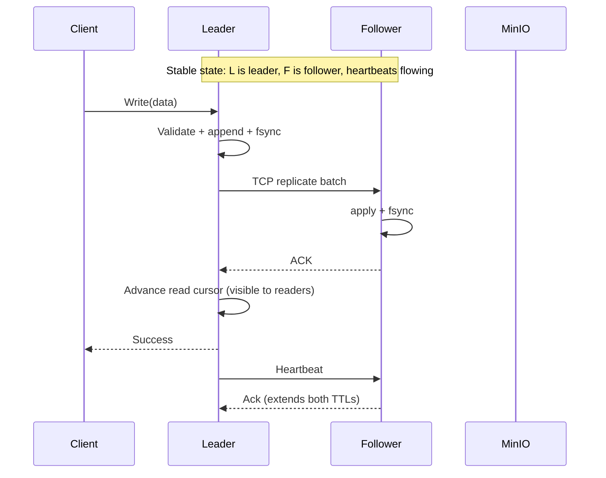

---

## Timeline: Cable Pull (Follower Offline)

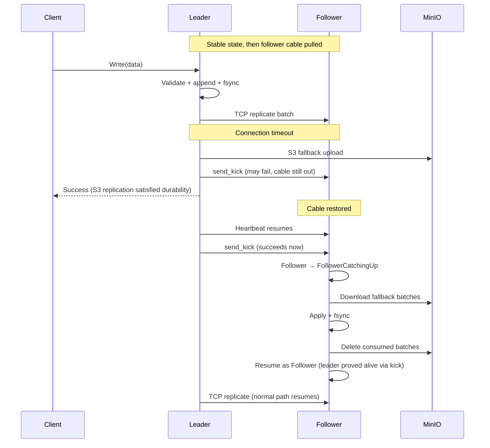

---

## Timeline: Cable Pull (Leader Offline)

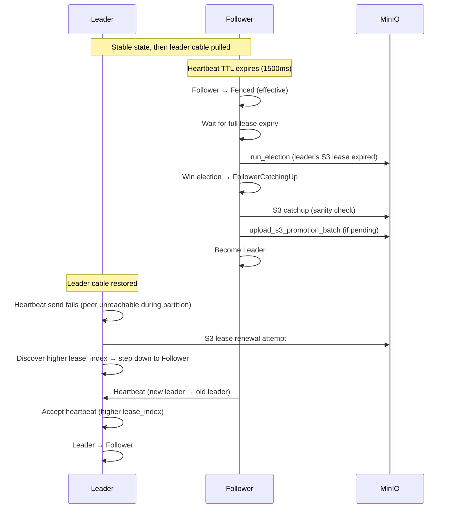

---

## Edge Cases for Gap Analysis

These are the scenarios where a WAL index gap can form between a follower's local
WAL and the S3 fallback batches:

### 1. TCP-only entries before S3 transition

**Sequence:** Leader TCP-replicates batch A to follower. Follower ACKs. Leader
commits. Next batch B: follower offline, S3 fallback. S3 has B but not A.

**Gap?** No gap on the follower (it has A on disk). Gap only affects a THIRD node
or a follower that lost A (crash without fsync, but the follower fsyncs before ACK).

**Risk:** If the follower's data directory is wiped but S3 is not, the follower
cannot rebuild from S3 alone (A is missing). This is by design. S3 is a
catch-up mechanism, not a full backup.

### 2. Leader rollback with leadership change

**Sequence:** Leader sends batch X via TCP (follower ACKs). Leader then tries
batch Y: TCP fails, S3 fails, rollback (Y reverted). Leader's S3 lease expires.
Follower wins election, becomes leader. S3 has no X (TCP-only). Follower writes
X+1 via S3. Old leader rejoins: S3 has X+1 but not X.

**Mitigation:** `upload_s3_promotion_batch`. The new leader uploads X to S3 on
promotion, before accepting writes.

### 3. Leader rollback without leadership change

**Sequence:** Leader sends batch X via TCP (follower ACKs). Leader then tries
batch Y: TCP fails, S3 fails, rollback. Leader stays leader. New writes resume
from rollback point. Follower goes offline. Leader falls back to S3 for new
batches. S3 starts after rollback point but TCP-replicated batch X exists only
on both local disks.

**Gap?** No gap. Both nodes have X. When follower catches up from S3, it already
has X locally. The S3 batch's `skip` logic handles the overlap.

### 4. Partial TCP delivery

**Sequence:** Leader sends paginated batch (chunk 1: A..B, chunk 2: C..D).
Chunk 1 succeeds (drained from workset). Chunk 2: connection drops mid-send.
Leader falls back to S3 for remaining entries (C..D). Next cycle: new entries
(E..F) also go to S3.

**Gap?** No. S3 batches are C..D and E..F, contiguous. Follower has A..B from
TCP and C..F from S3.

### 5. Fsync delay window on follower

**Sequence:** Follower receives TCP batch, queues in memcache. Fsync coordinator
hasn't fired yet (17ms delay). Cable pulled. Follower restarts. Write cursor
is at pre-batch position (fsync never completed).

**Gap?** No gap from S3 perspective. The follower didn't ACK (fsync didn't complete),
so the leader didn't drain those entries. The leader retries (TCP or S3 fallback)
with the same entries.

### 6. S3 batch consumed then crash

**Sequence:** Follower downloads S3 batch for shard 1, applies + deletes from S3.
Then shard 3's batch fails. Process crashes. On restart: shard 1's batch is gone
from S3 (deleted), shard 3's batch is still there.

**Gap?** No gap per-shard. S3 deletion is per-shard. Shard 1 already applied its
batch (durable). Shard 3 retries from the same position.

### 7. Stale data from previous crash-loop

**Sequence:** Follower crash-loops through multiple S3 catchup attempts. Each
attempt may partially truncate the WAL (TipHashMismatch handling). WAL ends up
at an inconsistent position relative to what S3 has. On next clean startup, S3
batches don't align with the truncated WAL.

**Gap?** Possible. The truncation + crash leaves the WAL at a position that
doesn't match any S3 batch boundary. Mitigation: `WalIndexMismatch` deferral
to TCP replication.

---

## Default Configuration Values

| Parameter | Default | Purpose |
|-----------|---------|---------|
| `heartbeat_interval_ms` | 500 | Leader heartbeat send interval |
| `heartbeat_lease_duration_ms` | 1500 | Follower TTL extension per heartbeat |
| `max_clock_drift_ms` | 500 | Clock drift tolerance, early fencing margin |
| `fsync_delay` | 17ms | Batching window for fsync coordinator |
| `max_request_size` | 16 MiB | TCP replication chunk size bound |
| `max_response_size` | 64 MiB | Response size bound |

---

## Open Questions

1. **S3 continuity on TCP-to-S3 transition:** When the leader transitions from TCP
   to S3 replication mid-stream, is S3 guaranteed to have all entries from the
   follower's perspective? The leader only uploads the current batch, not
   historical TCP-only entries. Under what conditions does this create an
   unrecoverable gap?

2. **Rollback + immediate S3 success:** If the leader rolls back batch Y, then
   immediately writes new entries Z that successfully go to S3, does the
   follower's local WAL (which has the rolled-back Y) correctly handle the
   hash chain divergence when catching up?

3. **Multiple rapid rollbacks:** Under sustained dual failure (TCP + S3 both
   flaky), can multiple rollback cycles create a WAL state on the leader that
   diverges significantly from the follower's state? How far can the WAL
   positions drift?

4. **Promotion batch upload failure:** If `upload_s3_promotion_batch` fails
   (S3 temporarily unavailable), the new leader proceeds without uploading.
   The old leader can only catch up via TCP. What if TCP catchup also fails
   (entries compacted away)?

5. **Coordinator shard isolation:** With `reserve_coordinator_shard`, shard 0
   has no write load. But schema registration still routes to shard 0. Under
   what schema write patterns could shard 0 become a bottleneck?
