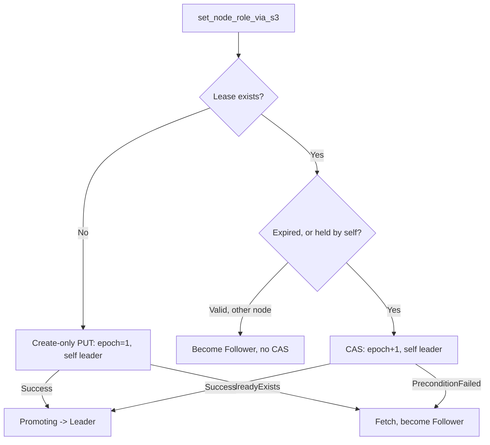

# Leadership & Replication Design

Celeriant is a distributed, append-only event store built for the write side of
event sourcing. Rust, thread-per-core (Glommio/io_uring), Direct I/O, one WAL per
shard. Two-node clusters coordinate through S3 and fall back to it for
replication. Every acknowledged write is fsynced on the leader and durable on a
second storage system (follower disk or S3) before the client sees Ok.

This is the implementation spec for cluster coordination, election, replication,
and the visibility model. Enough detail to re-implement from scratch.

## S3 Conditional Writes as the Consensus Protocol

Celeriant does not run Raft or Paxos. Why carry a third node, log matching,
pre-vote, and joint consensus when the deployment target is exactly two nodes and
an object store is already in the stack for fallback durability?

Election and coordination run entirely through S3 conditional writes: CAS on a
single `cluster/lease.json` object using etag preconditions. A monotonic
`lease_epoch` kills ABA races. Nodes self-fence on asymmetric TTLs, so the leader
stops writing before the follower can win an election.

The trade-offs are explicit: a clock dependency bounded by `max_clock_drift_ms`,
a hard two-node ceiling, ~1.5s failover, and an object-store dependency during
partitions. In exchange: zero coordination traffic on the healthy write path. In
steady state with both nodes reachable, S3 is never touched. Not for lease
renewal, not for data. The chaos baseline enforces this (`NoS3Fallbacks`,
`NoHeartbeatFailures`).

## Node States

Seven states (`node_status.rs`):

```
Standalone                                  writes accepted, no cluster
BootCatchup ──► Leader | Follower           process start
Follower ──► FollowerCatchingUp ──► Follower
Follower ──► Promoting ──► Leader           won the CAS, flip in progress
Leader ──► Follower | Fenced
Promoting ──► Follower | Fenced             lost the race / overran
Fenced ──► Leader | Follower | BootCatchup
```

Rules that matter:

- Only `Leader` and `Standalone` accept writes. Every write path checks
  `effective_node_status()` synchronously before entering the pipeline.
- `Leader`, `Follower`, and `Promoting` decay to `Fenced` at
  `expires_at - max_clock_drift`. An overrunning promotion self-fences the same
  way an expiring leader does; there is no state a node can hide in past its TTL.
- `BootCatchup`, `FollowerCatchingUp`, `Fenced`, and `Standalone` are TTL-exempt.
- `Leader ──► Promoting` and `Standalone ──► Promoting` are invalid. Promoting is
  reachable only from the follower side of an election.
- `FollowerCatchingUp` cannot go directly to `Leader`. It returns to `Follower`
  first, then challenges like any follower.

`Promoting` exists because the window between winning the CAS and opening writes
has real work in it (tail reconciliation, S3 catchup, promotion upload, the
flip-drain). Publishing `Promoting` to every shard at CAS-win closes the window's
races: TCP replication from the old leader is rejected, zombie heartbeats are
refused unless they carry a higher epoch, and the promotion-batch upload gate
admits the node before the final flip.

## Leader Election

S3 holds one `cluster/lease.json`. Election is a conditional PUT on its etag.



A node that sees a valid unexpired lease held by the other node becomes follower
without attempting the CAS. Only an expired or self-held lease triggers a race.

`lease_epoch` increments only on `promote` (leadership changing hands or being
re-taken). `renew` holds the epoch constant. The epoch is therefore strictly
monotonic across hand-offs, and every metablock a leader writes carries it.

## S3 Object Layout

```
cluster/
├── lease.json          leader_node_id, lease_epoch, acquired_at_ms, expires_at_ms
├── membership.json     [Option<NodeInfo>; 2] — a third node cannot join
└── fallback/
    └── shard_{id:03}/
        └── batch_{start:09}_{end:09}_{node_uuid}.bin
```

`NodeInfo` is `node_id` (u128), `client_address`, `replication_address`. Each
node registers itself at boot; the leader discovers the follower's replication
address from membership, not from heartbeats.

Fallback batches are bincode with an 8-byte header (`[CRC32C 4B LE][version 4B
LE]`, version 1). Zero-padded names make lexicographic order equal temporal
order.

## Heartbeat Protocol

Heartbeats flow leader-to-follower only, on shard 0 only, every
`heartbeat_interval` (500ms). The follower extends its TTL to
`max(current, leader_ts + heartbeat_lease_duration)` and acks with
`follower_can_accept_tcp_replication`. The leader extends its own TTL on each
ack and broadcasts `StatusUpdate` + `FollowerReachable` to all shards.

**Asymmetric fencing.** The leader fences itself at
`expires_at - max_clock_drift` (500ms early). The follower challenges only at
full `expires_at`. That gap is the guarantee: the leader has stopped writing
before the follower can win.

**Hard timeout.** Each heartbeat send is wrapped in
`heartbeat_timeout × heartbeat_hard_timeout_multiplier` (default ×4 = 2s).
Kernel TCP retransmits under saturation can block a kTLS send for 20+ seconds;
without the outer timeout that starves the heartbeat task and costs leadership.

**Failure path (leader side):**

- No peer known: exponential backoff discovery (1s, 2s, 4s, capped at
  `s3_lease_duration / 2`).
- First failure after the peer was reachable: preemptive S3 lease renewal,
  immediately. Renew before the fallback upload load lands on the object store.
- Peer known, still unreachable: check S3 when
  `lease_remaining <= s3_lease_duration / 2`.
- While TCP heartbeats succeed: S3 is never touched.

## Connection Management

The leader holds two TCP connections to the follower, separately locked, so
replication traffic cannot starve heartbeats.

- **Replication connection:** batches, kicks, commit-notifies. Persistent, reset
  on error.
- **Heartbeat connection:** heartbeats only. A fresh TCP connection every
  attempt. A reused connection could block in the kernel for the full
  `request_timeout` against a dead peer, which is precisely when the heartbeat
  must fail fast.

## Boot Sequence

Every non-standalone node starts in `BootCatchup`. The orchestrator runs on
shard 0: register on membership, run S3 catchup across all shards, then elect.

Client connections are accepted immediately at boot. Reads serve at any time;
writes reject with `WRITE_NOT_LEADER` until `Leader` or `Standalone`.

**Boot grace.** A fast restart lands in milliseconds, but the lease is only
renewed on heartbeat failure, so a healthy leader's lease can be wall-clock
expired in S3. If catchup finds a foreign lease that is also expired, the node
waits up to `min(heartbeat_lease_duration_ms, 5000ms)` for an incoming heartbeat
before challenging. A live heartbeat means defer; silence means challenge. One
S3 GET, boot only.

**Post-election, in order:** record metrics, broadcast `UpdatePeerNodeId`, and
then on the promotion path: publish `Promoting` to all shards, reconcile the
durable tail, run post-promotion S3 catchup, upload the promotion batch. Then
set addresses, broadcast `UpdateLeaderClientAddress` and `UpdateFollower`, and
publish the final `StatusUpdate` that flips the node `Leader`.

## Shard 0 Coordination

Shard 0 orchestrates through an intrashard mesh (bounded channels, retried
sends). The message set: `Shutdown`, `ClientConnectionRedirect`,
`ClusterConnectionRedirect`, `ExtensionConnectionRedirect`,
`CullSpeculativeTail{TailReconciliation}`, `RenewS3LeaseNow`, `EnterS3Catchup`,
`S3CatchupComplete`, `StatusUpdate`, `UpdatePeerNodeId`, `UpdateFollower`,
`FollowerReachable`, `PeriodicProbe`, `HeartbeatInFlightStarted`,
`HeartbeatInFlightCleared`, `UpdateLeaderClientAddress`, `SchemaRegistration`,
`SchemaRegistrationComplete`.

With `reserve_coordinator_shard` enabled, data routing skips shard 0
(`routing_id % (num_shards - 1) + 1`) so write load cannot starve the heartbeat
task. Shard 0 still binds a client listener; schema registration and redirects
land there.

S3 catchup fan-out: shard 0 broadcasts `EnterS3Catchup`, runs its own catchup
synchronously, and collects `S3CatchupComplete` from every shard. Fatal errors
shut the cluster down; transient S3 errors retry after 5s.

## Write Pipeline

Four sequential phases; the client ack waits for all four.

1. **Validate.** Snapshots, OCC, idempotency, schema.
2. **Append.** Queue in memcache.
3. **Fsync.** Coordinator batches writers: first writer sleeps `fsync_delay`
   (17ms) to batch, captures the snapshot, and fsyncs under `sync_gate` (one
   fsync at a time). Datablocks, metablocks, dual headers, fdatasync.
4. **Replicate.** Coordinator batches again, sends TCP (or S3 fallback), and
   commits.

Two pipeline guards matter for latency and correctness:

- **Fast path gate.** The replication coordinator's low-latency fast path is
  gated on `last_two_phase_batched`, so a free coordinator under load does not
  fragment batches and de-amortise the pipeline.
- **Confirmation gate.** The write's ack is not released until the read cursor
  confirms the write tip; the gate re-enters the coordinator until it does. A
  TCP success whose commit did not land yet cannot produce a premature ack.

## The Visibility Model: Three Commit Rules

Durability and visibility are decoupled everywhere. An fsync makes bytes
durable; a *commit* makes them visible: advance the read cursor, populate read
snapshots and the recent-write cache, contribute to segment summaries, fire
watch events. `commit_pcd` is the single commit implementation; the only thing
that varies is who triggers it, and when.

`CommitTarget` (`shard_wal_sync.rs`) picks the rule by write provenance, not by
`is_leader()`:

| Provenance | CommitTarget | Commit trigger |
|---|---|---|
| Leader client write | `DeferToReplicationAck` | replication ack |
| Follower live-TCP apply | `DeferToLeaderConfirmed` | carrier's `leader_confirmed_wal_seq` |
| S3 catchup, standalone | `FullCommit` | the fsync itself |

### Leader: commit on replication ack

After a successful replicate, in order: `commit_pcd` applies the read-side
commit (cursor, caches, watch events), then `last_self_acked_wal_seq` is bumped
and the header is synchronously fsynced, then the client gets Ok. The ack
barrier is durable before the ack exists, so a crash after Ok can never be
truncated below what clients were told.

The commit also finalizes sealed segments (a non-active segment whose
`read == write` gets its sidecar summary written, best-effort) and broadcasts
watch events in fixed order: Create, Write, Delete, Trim.

### Follower: park, then drain on confirmation

The follower fsyncs replicated batches durable but *invisible*. A batch that
would have committed at fsync time instead parks: the fsync pushes its
`PendingCommitData` onto a wal_seq-ordered queue in the shard memcache
(`push_parked_commit`). The queue never drops; exceeding the byte cap only
trips `celeriant_parked_commit_overflow_total`.

Visibility advances when a carrier proves the leader committed:

```
read = max(read, min(leader_confirmed_wal_seq, write))
```

Every replication request carries the leader's confirmed index. The drain pops
parked batches whose fsync-time tip the carrier covers and runs `commit_pcd` on
each, in order. Two drains bracket the data fsync: one before (`sync_durable`'s
own header write then persists the advanced cursor for free) and one after (for
carriers that confirm at-or-past the new tip). Confirm-only carriers with no
data fsync are followed by a coordinator-serialized header-only sync, tracked by
`read_wal_synced`, so the advanced cursor is never left memory-only.

Two structural cases fall out of the same formula. A stale carrier drains
nothing (the queue only holds batches above read). After a crash-restart the
queue is empty but the durable prefix is real: when the carrier confirms exactly
the write tip and nothing is parked, a bare cursor advance is the whole commit,
because the caches are cold anyway.

Schema registrations compile on drain on the follower (`commit_pcd` takes the
codec; the leader compiled at write time and passes nothing).

Watch semantics follow directly: a follower-side subscriber sees an event only
at-or-after the leader committed it, exactly once, in order. The parked tail's
events fire at the drain that commits it, never at fsync.

### Commit-notify: idle convergence without polling

Under load, carriers arrive constantly and the follower's read lag is
batch-scale. At idle the last batch's confirmation has no later carrier to ride.
Waiting for the 5s reachability probe would leave a multi-second visibility gap
on an idle cluster.

The leader closes it with a commit-notify: after a burst completes, a detached
post-burst task sends an empty-batches replication request carrying the
confirmed index. On the receiver, an empty request that passes every existing
guard (time drift, epoch, state) *is* the notify: it runs the same floor-update,
parked drain, and cursor persistence the data path runs, and is structurally
chain-neutral. An empty batch failing a guard is rejected with that guard's
reason; a zombie leader's notify fences as `StaleLease` like any other request.

The sender's floor rises to the index actually sent, so overlapping bursts do
not re-notify stale values. The spawn is budget-gated; the gate's metrics
distinguish fenced from exhausted. Notify loss is legal (rollback-flag death,
reachability flip, latch skip) because the probe nets every survivor: follower
visibility lag is bounded by the probe interval, not the notify window.

`celeriant_commit_notify_sent_total` on the leader equals
`celeriant_commit_notify_received_total` on the follower when no notify was
lost; chaos runs assert the pairing.

## Replication: Capture, Send, Commit

**Capture.** The replication coordinator uses the same two-phase pattern as
fsync. Capture checks the rollback flag first, then drains
`pending_replication_batches` atomically, then checks empty
(`NoCaptureRaceButOk` for the harmless race). Checking rollback before the drain
distinguishes "empty because idle" from "cleared by rollback".

**Backpressure.** The pending queue is bounded indirectly: a 64MiB inflight-byte
cap rejects new writes at admission. Queue pressure pushes back on clients; it
does not silently reroute to S3.

**Send.** TCP in chunks bounded by `max_request_size` (16MiB). The follower
validates each batch four ways: WAL sequence continuity, tip-hash chain, internal
contiguity, and sender epoch at-or-above its own (plus time-drift). On
`WalSeqMismatch` (follower behind), the leader fetches the gap from its own WAL
and sends it as separate chunked catchup requests, then retries the original.
Too far behind, or any second rejection: S3 fallback plus a kick.

**Mid-spin fencing.** Replication failure spins in place: 50ms backoff doubling
to an effective 400ms cap, 30s hard timeout, `is_leader()` re-checked every
iteration and again after each successful send before the ack-barrier bump. A
lease that lapses mid-pipeline returns `LeaderFenced` and leaves the captured
snapshot in pending — no rollback, no cursor rewind. The next trigger or a role
transition sweeps it. Holding the writer's await on the pending snapshot is what
prevents silent loss when a client disconnects mid-retry.

Terminal errors (auth, serialization, malformed batches) bail immediately;
everything else spins.

**Idle drains.** A 5s reachability probe in the heartbeat loop fires
`probe_replicate` so a tail that missed its window drains without waiting for
the next client write.

## S3 Fallback

When TCP fails (follower offline, too far behind, connection error), the leader
uploads the batch as a `FallbackBatch` object and fires a kick: a fire-and-forget
task, latch-limited to one in flight per shard, so commit latency never waits on
a dead follower's connect timeout. Uploads across all shards share a global cap
(`s3_max_concurrent_fallback_uploads`, default 128).

The kick flips the follower to `FollowerCatchingUp`. In that state (and in
`BootCatchup`) the follower still acks heartbeats but reports
`follower_can_accept_tcp_replication = false`, so the leader routes commits
straight to S3 without burning a rejected TCP round-trip.

**Catchup per shard:** list objects, filter to the peer's uploads, dedupe (same
start, keep largest end), validate contiguity, then download-apply-fsync-delete.
Catchup applies with `FullCommit` — no leader confirmation is needed because an
S3-listable batch was durably uploaded by a leader before it acked. Any parked
live-TCP commits below the new tip are committed first, so the cursor stays
monotonic and their watch events fire exactly once.

A kicked follower resumes as `Follower` without an election: the kick itself
proved the leader alive. Boot catchup ends in an election instead.

**Divergence.** On `TipHashMismatch`, `find_divergence_via_s3` returns a
conservative divergence floor (the start of the matched batch), and a byte-match
walk advances it past every byte-identical entry. Truncation then runs only above
the ack barrier: a truncate at-or-below `last_self_acked_wal_seq` would rewrite
history this node acked, so it refuses loudly (`TruncateRefusedByAckBarrier`,
retriable) and stays in catching-up until an operator looks. Truncation commits
the surviving parked prefix below the divergence point (their events fire exactly
once, here) and discards the rest without firing anything — those entries left
the chain.

## Promotion and Demotion

The durable tail at a role transition is the dangerous asset. Whether to commit
it or destroy it is a provenance question, and provenance survives crashes only
on disk: a reverse scan of the tip metablock's author `node_id` decides. Mixed
tails are impossible; a leader never chains onto unacked foreign speculation, and
the demotion cull runs before peer data is accepted.

`TailReconciliation` names the three transitions:

- **`CommitForPromotion`** — the winner's tail is peer-received replicated data
  the dead leader may have acked. The flip-drain takes every parked commit,
  runs `commit_pcd` on each, advances the cursor, and fsyncs the header. An
  error here fails the election (`PromotionFlipGate::Abort`); a node that cannot
  commit its tail must not open writes. Losing the CAS race mid-window steps
  down gracefully (`LostRace` adopts the observed follower status).
- **`RewindToAckBarrier`** — demotion from held leadership. Own speculation
  above the ack barrier is unacked by construction (the barrier fsync precedes
  every Ok), so the write cursor rewinds to read, the culled range's parked and
  pending state clears without firing events, and the OCC/write LRUs drop.
- **`ReconcileAsFollower`** — boot as follower behind a peer's lease. A peer
  tail stays parked for normal confirmation; an own-speculation tail culls as in
  demotion.

**Promotion floor.** Followers track `last_received_replication_wal_seq` as
`confirmed + 1`, monotonic. At promotion it bounds the S3 upload of the
unconfirmed range, so a partitioned old leader can later catch up from S3 a
batch the dead leader never uploaded. A fully-confirmed idle follower has floor
= tip + 1 and correctly uploads nothing. The floor clears only at the final
Leader flip, which doubles as the crash re-entry marker: a node that died
mid-promotion resumes the pipeline (`promotion_resume_owed`) instead of
assuming the flip completed.

The upload gate admits `Leader | Promoting`, so the upload runs inside the
promotion window on every shard, coordinator included.

## Steady-State Loops

**Leader:** heartbeat every 500ms; on ack, extend TTL and broadcast; on failure,
the escalation ladder from the heartbeat section. While heartbeats succeed the
loop never touches S3.

**Follower:** sleep until TTL expiry (500ms cap for shutdown responsiveness).
Heartbeat reception lives on the shard-0 connection handler, which extends the
TTL and broadcasts; the orchestrator loop only detects expiry and challenges.

## Split-Brain Prevention

Five overlapping mechanisms:

1. **Asymmetric TTL decay.** The leader self-fences `max_clock_drift` early;
   the follower challenges at full expiry. The gap guarantees a stopped leader
   before a new one can exist.
2. **Monotonic `lease_epoch` on every metablock.** A superseded leader cannot
   produce a current epoch; the follower rejects `StaleLease` on TCP, catchup,
   and commit-notify alike.
3. **Per-shard write gating.** Every write checks `effective_node_status()`
   synchronously. Fenced means rejected before the pipeline.
4. **Post-publish lease re-check.** After a successful replicate and before the
   `last_self_acked` bump, the leader re-reads its status and refuses the bump
   if fenced. Closes the in-process dual-ack leg where the fence flipped between
   TCP success and the ack. Local atomic read, no S3 on the write path.
5. **Ack-barrier truncate refusal.** Catchup cannot truncate at-or-below
   `last_self_acked_wal_seq`, ever. Even if the other four miss, a node's own
   acked history cannot be silently rewritten.

Residual risk: clock drift beyond `max_clock_drift_ms` closes the asymmetric
window. The epoch check is the last line then. Deployment keeps
`heartbeat_lease_duration_ms << s3_lease_duration_ms` to bound the degraded-mode
dual-ack geometrically, and the cluster nodes run chrony (continuous discipline,
~1ms relative drift) rather than step-only time sync.

## Observability

The visibility split is instrumented end to end, per shard:

- `celeriant_wal_seq` / `celeriant_read_wal_seq` — durable tip and committed
  cursor. The read gauge sources `committed_read_wal_seq()`, which is
  rotation-aware (an active segment's read is None right after rotation while
  the cursor sits in the predecessor).
- `celeriant_follower_read_lag` — write minus read; batch-scale under load,
  zero at quiesce.
- `celeriant_parked_commit_queue_depth` — refreshed at every queue mutation:
  deferred fsync, drain, promotion flip, catchup drain, truncate, cull. A
  plateau above zero on an idle shard is a drain leak.
- `celeriant_parked_commit_overflow_total` — inflight-cap tripwire; nothing is
  dropped.
- `celeriant_commit_notify_sent_total` / `..._received_total` — pair equality
  means no notify lost.
- `celeriant_last_self_acked_wal_seq` — the ack barrier, set at the bump and on
  boot recovery. Survives demotion and restart.
- `celeriant_node_status_code` — per-shard status (0=BootCatchup, 1=Follower,
  2=FollowerCatchingUp, 3=Promoting, 4=Leader, 5=Fenced, 6=Standalone).

The chaos suite asserts the model's two cross-node invariants on every named
scenario: **NeverAhead** (in steady follower windows, the follower's committed
cursor never exceeds what any leader tenure confirmed — bounded by the
all-tenure leader-read high-water and the follower's own ack barrier) and
**ReadConvergedAtQuiesce** (read equals write on both nodes, every shard, at
end-of-run quiesce). NeverAhead is proven red against a build that commits at
follower fsync; restart-scenario passes attest steady windows clean, by design.

## Configuration Defaults

| Parameter | Default | Purpose |
|---|---|---|
| `heartbeat_interval_ms` | 500 | leader heartbeat cadence |
| `heartbeat_lease_duration_ms` | 1500 | TTL extension per heartbeat |
| `max_clock_drift_ms` | 500 | drift tolerance; early-fence margin |
| `heartbeat_hard_timeout_multiplier` | 4 | outer heartbeat timeout vs kernel stalls |
| `s3_max_concurrent_fallback_uploads` | 128 | global fallback upload cap |
| `fsync_delay` | 17ms | fsync coordinator batching window |
| `max_request_size` | 16 MiB | TCP replication chunk bound |
| `max_response_size` | 64 MiB | response bound |
