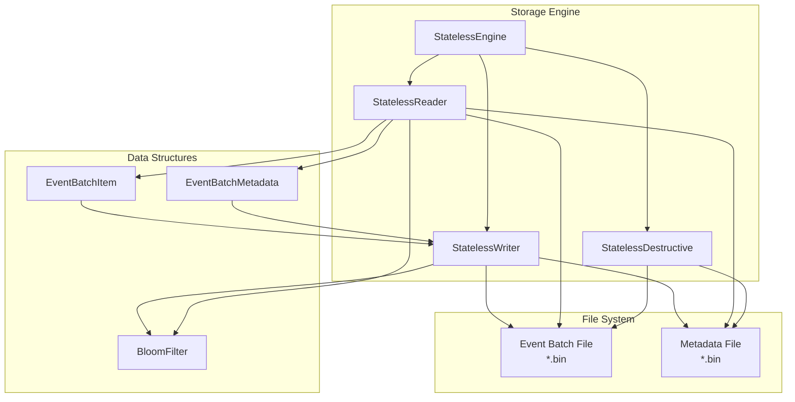
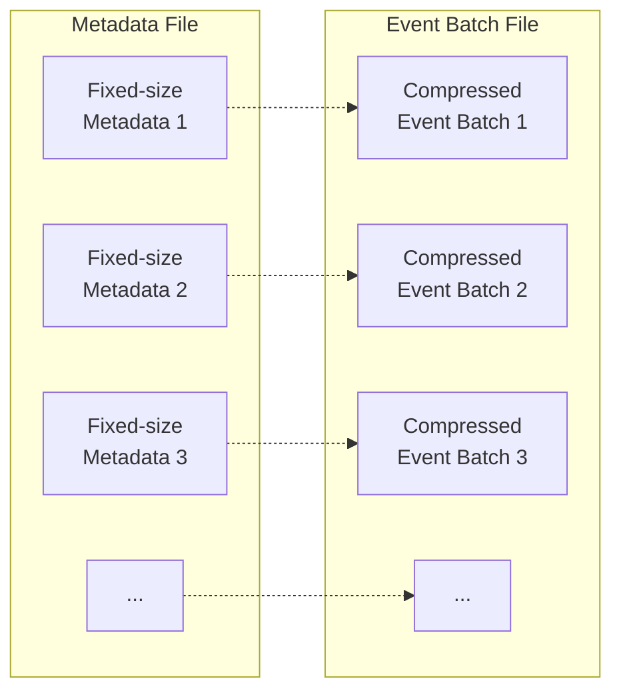
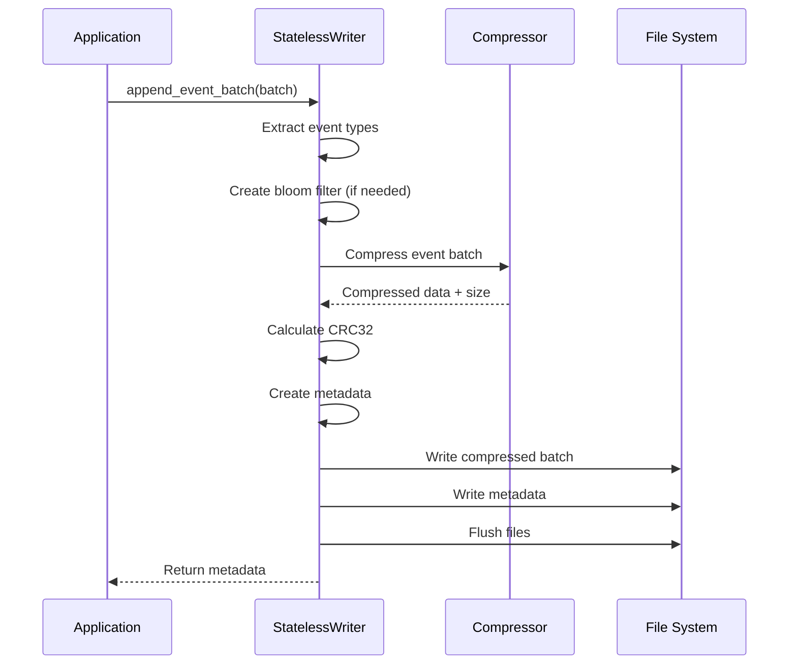
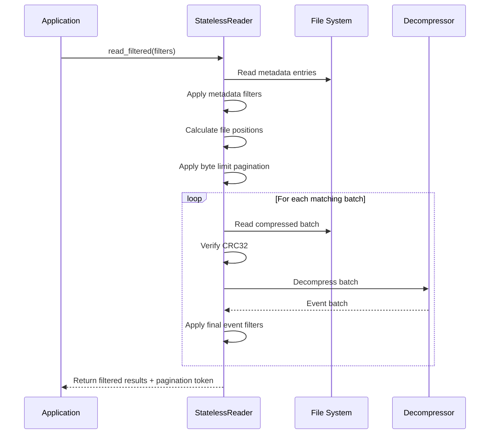
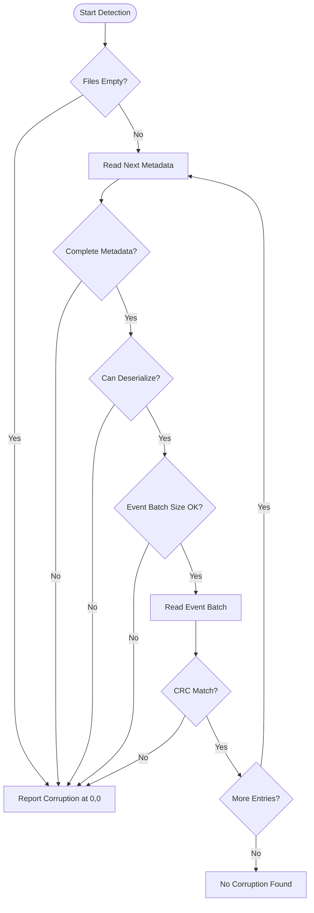
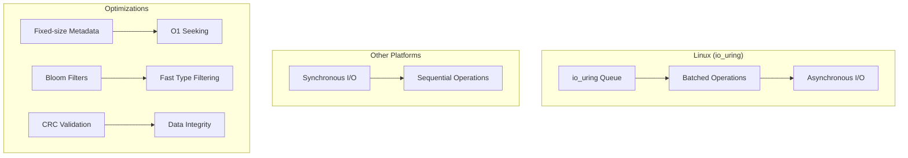

# EventPlaneDB Storage Stateless

A high-performance, stateless storage engine for event sourcing databases that provides efficient reading, writing, and management of event batches with advanced filtering, compression, and corruption detection capabilities.

## Overview

The `eventplanedb_sync_stateless` crate is the core storage layer for EventPlaneDB, designed to handle large volumes of event data with minimal memory overhead and maximum I/O efficiency. It operates in a stateless manner, meaning all operations work directly with file handles without maintaining in-memory state.

## Key Features

- **High-Performance I/O**: Leverages io_uring on Linux for maximum throughput
- **Multiple Compression Algorithms**: Zstd, Snappy, Brotli, Gzip, and uncompressed
- **Advanced Filtering**: Event type, timestamp, client ID, user ID, and range-based filtering
- **Corruption Detection**: CRC-based integrity checking with precise corruption location
- **File Management**: Trim operations (start/end) and safe file deletion
- **Pagination Support**: Size-based pagination for memory-efficient large result sets

## Architecture



## File Structure

The storage engine maintains two synchronized files:



### Metadata Structure

Each metadata entry contains:

- Event batch index and timestamp information
- Client and user IDs
- Compression type and sizes
- CRC32 checksum for integrity
- Event type information (direct array or bloom filter)
- Min/max ranges for efficient filtering

The key concept behind the metadata file is each event batch is a fixed length, allowing efficient seeking based on event batch indexes.

## Core Operations

### Writing Event Batches



### Reading with Filters



### Corruption Detection



## Usage Examples

### Basic Write/Read Cycle

```rust
use eventplanedb_sync_stateless::*;
use eventplanedb_structures::*;

// Create the engine
let engine = StatelessEngine::builder()
    .with_io_uring_queue_depth(64)
    .build();

// Write an event batch
let events = vec![EventItem::new(1, 1, 1000, 42, 1, b"event data".to_vec())];
let batch = EventBatchItem::new(1, 1600000000000, 123456789, Some(987654321), events);

let mut event_writer = File::create("events.bin")?;
let mut metadata_writer = File::create("metadata.bin")?;
let bloom_filter = BloomFilter::with_num_bits(BLOOM_BYTES * 8)
    .seed(&BLOOM_HASH_SEED)
    .hashes(BLOOM_HASH_COUNT);
let mut event_type_dedup = HashSet::new();

let metadata = engine.append_event_batch(
    &mut event_writer,
    &mut metadata_writer,
    &mut bloom_filter,
    &mut event_type_dedup,
    CompressionType::Zstd { level: 3 },
    &batch,
)?;

// Read with filters
let mut event_reader = File::open("events.bin")?;
let mut metadata_reader = File::open("metadata.bin")?;

let mut filters = ReadFilters::new(1);
filters.include_event_types = Some(vec![42]);
filters.max_bytes = Some(1024 * 1024); // 1MB limit

let result = engine.read_filtered(&mut event_reader, &mut metadata_reader, &filters)?;
```

### Advanced Filtering

```rust
// Complex filtering example
let mut filters = ReadFilters::new(100); // Start from event batch index 100
filters.to_event_batch_index = Some(200);
filters.include_client_id = Some(123456789);
filters.min_event_timestamp = Some(1600000000000);
filters.max_event_timestamp = Some(1700000000000);
filters.include_event_types = Some(vec![1, 2, 3, 42]);
filters.max_bytes = Some(10 * 1024 * 1024); // 10MB limit

let result = engine.read_filtered(&mut event_reader, &mut metadata_reader, &filters)?;

// Handle pagination
if let Some(next_index) = result.next_event_batch_index {
    filters.from_event_batch_index = next_index;
    let next_page = engine.read_filtered(&mut event_reader, &mut metadata_reader, &filters)?;
}
```

### File Management

```rust
// Detect and handle corruption
if let Some(corruption) = engine.detect_corruption(&mut event_reader, &mut metadata_reader)? {
    println!("Corruption detected at metadata position: {}, event position: {}", 
             corruption.metadata_position, corruption.event_batch_position);
    
    // Trim corrupted data
    let mut event_writer = BufWriter::new(File::options().write(true).open("events.bin")?);
    let mut metadata_writer = BufWriter::new(File::options().write(true).open("metadata.bin")?);
    
    engine.trim_end(
        &mut event_writer,
        corruption.event_batch_position,
        &mut metadata_writer, 
        corruption.metadata_position,
    )?;
}

// Trim old data (e.g., after archiving to object storage)
engine.trim_start(
    &mut event_reader,
    keep_from_event_position,
    "events.bin",
    &mut metadata_reader,
    keep_from_metadata_position,
    "metadata.bin",
)?;
```

## Performance Characteristics

### I/O Patterns



### Compression Trade-offs

| Algorithm | Speed | Ratio | Use Case |
|-----------|-------|-------|----------|
| None | Fastest | 1:1 | Maximum throughput |
| Snappy | Very Fast | ~3:1 | Real-time ingestion |
| Zstd | Fast | ~4:1 | Balanced (default) |
| Gzip | Moderate | ~5:1 | Storage optimization |
| Brotli | Slow | ~6:1 | Maximum compression |

## Error Handling

The crate provides comprehensive error handling for:

- **I/O Errors**: File system operations, permissions, disk space
- **Corruption Errors**: CRC mismatches, malformed data, truncated files  
- **Logic Errors**: Invalid parameters, empty batches, boundary conditions

All errors include detailed context for debugging and recovery operations.

## Thread Safety

The storage engine is designed to be thread-safe when used correctly:

- **Readers**: Multiple concurrent readers are safe
- **Writers**: Single writer per file pair recommended
- **Mixed**: Reader/writer coordination required by application

## Memory Usage

The engine is designed for minimal memory overhead:

- **Stateless**: No persistent memory state
- **Streaming**: Processes data in chunks
- **Configurable**: Specify the path of your metadata and event files directly
- **Bounded**: Memory usage independent of file size

## Dependencies

This crate depends on other EventPlaneDB components:

- `eventplanedb_structures`: Shared data structures and constants

Other notable 3rd party libraries:

- `bincode` - Binary serialization/deserialization for metadata and event data in files
- `fastbloom` - Used for event type filtering when we have more than 4 event types in a single batch
- `crc32fast` - For data integrity checks on the event batch data
- `zstd`, `brotli`, `flate2`, `snap` - various compression libraries
- `io-uring` - Low level rust crate to work with io_uring on linux
